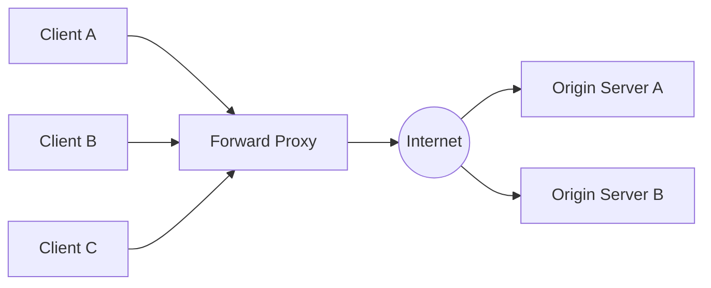
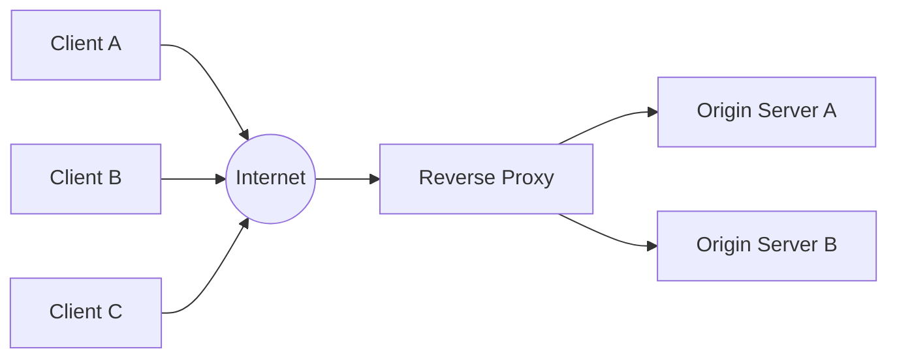

# Proxy

### Proxy란?

Proxy는 클라이언트와 원본 서버 사이에서 요청과 응답을 중계하는 시스템이다.
Proxy를 사용하는 통신에서는 클라이언트와 원본 서버 사이의 요청과 응답이 Proxy를 경유한다.

보안 정책 적용, 캐싱, 콘텐츠 필터링, 접근 제어, 로깅의 부분에서 장점이 있다.

크게 Forward Proxy와 Reverse Proxy로 나뉜다.

#### Forward Proxy

- 클라이언트 그룹에 위치하며, 클라이언트를 대신하여 중개자처럼 웹 서버와 통신한다.
- 장점 및 목적
  - 익명성 강화: 원본 서버로부터 클라이언트의 IP를 숨겨 신원 보호에 도움이 될 수 있다.
  - 콘텐츠 필터링: 정책에 따라 특정 URL, 도메인 또는 콘텐츠에 대한 접근을 허용하거나 차단한다.

#### Reverse Proxy

- 서버를 대신하여 클라이언트 요청을 받고, 적절한 원본 서버로 전달한다.
- 장점 및 목적
  - 부하 분산: 트래픽을 여러 서버에 분산하여 사이트의 가용성을 유지한다.
  - 보안 강화: 원본 서버의 IP 주소를 노출하지 않아 서버를 보호한다.
  - 캐싱: 캐시 가능한 응답을 저장하고 재사용하여 응답 지연과 원본 서버 부하를 줄인다.
  - TLS 종료: 연산 비용이 높은 SSL/TLS 암호화 및 복호화를 대신 수행하여 서버 리소스를 절약한다.

### 키워드

- VPN, NGINX, DNS, GSLB, SSL, CloudFront
