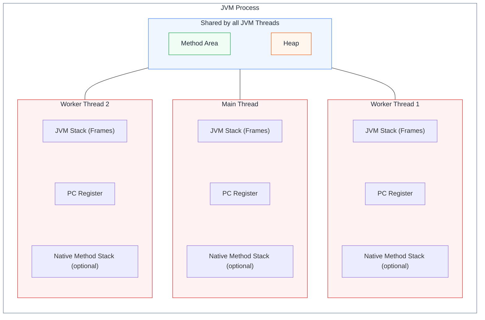

# Thread

### Thread란?

Thread는 프로세스 안에서 코드를 실행하는 흐름이다.
일반적인 `java Counter` 실행은 JVM 프로세스 하나를 시작한다. 그 안의 Thread는 일부 메모리를 공유하면서 각자의 실행 상태를 가진다.
`java Counter`를 두 번 실행하면 서로 독립적인 JVM 프로세스 두 개가 된다.

### JVM과 Thread

#### 1. Bytecode and Process

- `javac`는 Java 소스를 운영체제에 종속되지 않는 `.class` 바이트코드로 컴파일한다. 각 운영체제의 JVM이 이를 실행한다.
- JVM은 운영체제가 할당한 프로세스 메모리를 사용한다. 독립된 물리 메모리를 새로 만드는 것은 아니다.

#### 2. Shared Areas

- `Method Area`: 클래스 구조, 필드·메서드 정보, 메서드 코드 등을 보관하는 논리적 영역이다. 모든 Thread가 공유한다.
- `Heap`: 객체와 배열이 할당되는 영역이다. 여러 Thread가 같은 객체를 참조할 수 있다.
- `static` 필드는 객체별이 아닌 클래스 단위의 상태이므로 Thread가 공유한다.

#### 3. Thread-Private Areas

- `JVM Stack`: Thread마다 별도로 가지며, 메서드 호출마다 생성되는 Frame에 지역 변수와 연산 중간값 등이 있다.
- `PC Register`: Thread마다 현재 실행 중인 JVM 명령의 위치를 기록한다. Native Method 실행 중에는 값이 정의되지 않는다.
- `Native Method Stack`: JVM 구현이 네이티브 메서드 실행을 위해 제공한다면 Thread별로 사용한다.



연결선은 Method Area와 Heap을 각 Thread가 공유한다는 뜻이며, Thread별 세 영역은 서로 공유하지 않는다.

#### 4. Counter Example

```java
public class Counter {
    private int count = 0;

    void increment() {
        int next = count + 1;
        count = next;
    }

    public static void main(String[] args) {
        Counter counter = new Counter();
        Thread t1 = new Thread(() -> counter.increment());
        Thread t2 = new Thread(() -> counter.increment());

        t1.start();
        t2.start();
    }
}
```

- `Counter`의 클래스·메서드 정보는 Method Area에, `new Counter()`로 만든 객체와 `count` 필드는 Heap에 있다.
- Main Thread의 지역 변수 `counter`, `t1`, `t2`는 논리적으로 Frame에 있으며 Heap의 `Counter`·`Thread` 객체를 가리킨다. 두 작업 Thread는 같은 `Counter` 객체를 참조한다.
- `next`는 각 작업 Thread의 `increment()` Frame에 따로 존재한다. 그러나 두 Thread가 읽고 쓰는 `count`는 같은 객체의 필드다.
- 예시는 Main Thread 외에 작업 Thread 두 개를 시작한다. JVM 내부에서 실행하는 Thread는 별도이므로 전체 Thread 수를 3개로 단정할 수 없다.
- `count`의 읽기·계산·쓰기는 원자적이지 않다. 동기화하지 않으면 두 작업 Thread가 같은 값을 읽어 갱신 결과 하나가 사라질 수 있다.

### 키워드

- Process, Bytecode, Stack Frame, Race Condition, `synchronized`, `AtomicInteger`, Virtual Thread
