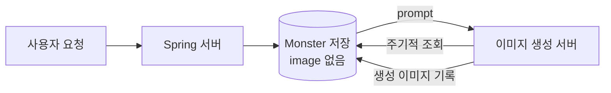

# 01. 과거 구조와 기록의 한계

## 결론 🧭

2025년 당시에는 이미지 생성 대상을 별도의 `Prompt` 테이블로 분리하고, 연속 요청과 생성 개수를 제한했다. 이후 최종 발표에서는 이전과 비슷한 규모의 요청을 처리했다. 따라서 당시 운영 환경에서는 시스템 안정화에 도움이 된 대응으로 판단했다.

다만 여러 변경을 함께 적용했고 처리 결과를 작업 단위로 측정하지 않았다. 각 변경의 기여도와 작업 유실·중복 여부까지 검증한 결과는 아니다.

## 과거 초기 구조

커켓몬은 사용자가 입력한 프롬프트로 몬스터 이미지를 생성했다. 당시에는 모델을 호출하는 별도 서버가 DB에서 이미지가 없는 대상을 조회하고, 생성 결과를 다시 DB에 기록하는 Polling 구조를 사용했다.

이 구조는 애플리케이션 서버와 이미지 생성 서버가 DB를 매개로 비동기 협력하는 최소 형태였다. 당시 선택 배경과 운영 결과는 [커켓몬 프로젝트 회고](https://kng0501.tistory.com/7)에 기록돼 있다.

## 확인 수준별 기록 🔎

### 확인된 사실

- 35명의 사용자에게 약 300건의 이미지 생성 요청이 들어왔다.
- 당시 시스템이 불안정해지는 경험이 있었다.
- 이후 `Prompt` 테이블과 연속 요청·생성 개수 제한을 적용했다.
- 최종 발표에서 이전과 비슷한 규모의 요청을 처리했다는 기록이 있다.

### 설계상 기대한 효과

- `Prompt` 테이블 분리: 이미지 생성 대상의 조회 범위를 줄이기 위한 선택.
- 요청 제한: 처리 용량보다 작업이 빠르게 쌓이는 상황을 막기 위한 선택.

두 항목은 설계 의도다. 개별 변경이 실제로 얼마만큼 기여했는지는 측정하지 않았다.

### 확인하지 못한 내용 ⚠️

- 여러 변경을 함께 적용했기 때문에 각 변경의 기여도는 알 수 없다.
- 당시 접수·완료·실패·유실·중복 작업 수는 측정하지 않았다.
- 당시 작업 유실이나 중복 실행이 실제로 발생했다고 단정할 수 없다.
- 당시 불안정 경험의 단일 원인은 확인하지 못했다.

## 두 종류의 변경을 구분한다

| 구분 | 범위 | 이 문서에서 내릴 수 있는 판단 |
| --- | --- | --- |
| 2025년 당시 안정화 | `Prompt` 테이블 분리, 연속 요청 제한, 생성 개수 제한 | 당시 규모에서 운영 안정화에 도움이 된 대응으로 판단 |
| 현재 신뢰성 개선 | 작업 상태, 원자적 선점, 처리 타임아웃 복구, 재시도, 멱등한 결과 반영 | 4단계부터 구현·검증 예정 |

현재 RED 테스트에서 드러난 현상은 **과거 코드와 유사한 재구성에서 확인한 잠재적 신뢰성 문제**다. 과거 운영 장애에서 같은 문제가 실제로 발생했다는 증거로 사용하지 않는다.

## 다음 단계

[02단계](../02-minimal-db-polling/README.md)에서는 2025년 당시 안정화 이후 구조와 유사한 최소 DB Polling 구조를 Java 21과 Spring JDBC로 재구성한다. 목적은 과거 장애 원인을 확정하는 것이 아니라, 현재 기준에서 신뢰성 불변식을 검증할 수 있는 기준 코드를 만드는 것이다.
