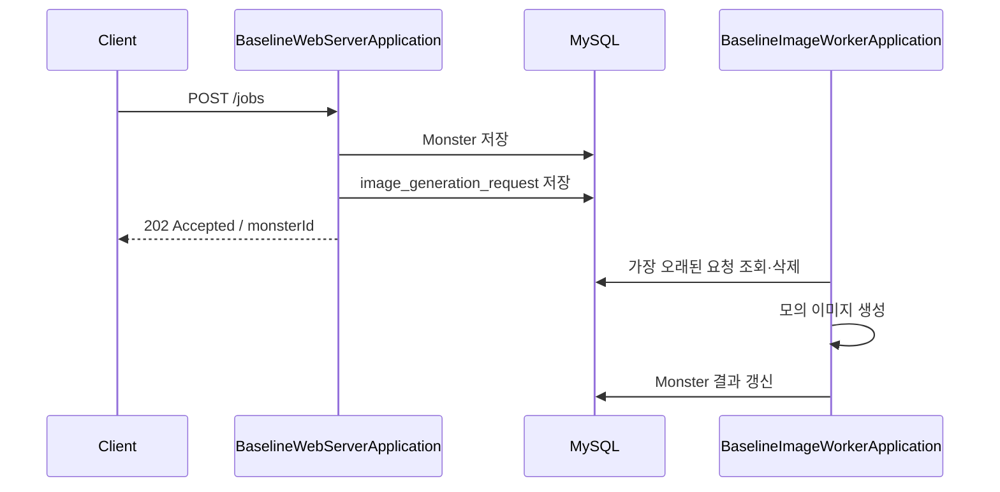

# 02. 최소 DB Polling 구조 재구성

## 결론 🧭

**채택:** 정상 상황에서 요청 등록부터 결과 반영까지 동작하는 최소 DB Polling 구현이다. `BaselineWebServerApplication`과 `BaselineImageWorkerApplication`은 별도 JVM이며 MySQL만 통해 협력한다.

**유지:** 이 단계는 장애와 동시 실행을 고려하지 않은 기준 구현이다. JPA 전환은 했지만 등록 원자성, 작업 상태, 원자적 선점, 타임아웃, 재시도, 멱등성을 추가하지 않는다.

## Application과 Bean 경계



| Application | 등록 Bean | 등록하지 않는 Bean |
| --- | --- | --- |
| `BaselineWebServerApplication` | Controller, `ImageGenerationService`, baseline JPA Entity·Repository | `DbPollingWorker`, `DbPollingScheduler`, `ImageGenerator` |
| `BaselineImageWorkerApplication` | `DbPollingWorker`, `DbPollingScheduler`, `ImageGenerator`, baseline JPA Entity·Repository | Controller, HTTP 서버 |

워커는 `WebApplicationType.NONE`으로 시작한다. Spring Profile로 역할을 고르지 않는다.

## 정상 처리 흐름 🔄

1. 웹 서버가 `POST /jobs`의 `prompt`를 받는다.
2. `Monster`를 저장한다.
3. `image_generation_request`에 이미지 생성 요청을 저장한다.
4. `202 Accepted`와 `monsterId`를 반환한다. 이미지 완료를 기다리지 않는다.
5. 워커가 100ms 간격으로 가장 오래된 요청을 조회하고 삭제한다.
6. 워커가 기본 5초의 모의 이미지 생성을 수행한다.
7. 워커가 결과 문자열을 Monster에 저장한다.

```bash
# 터미널 1
./gradlew runBaselineWebServer

# 터미널 2
./gradlew runBaselineImageWorker
```

기본 모의 Generator는 `image:{prompt}`를 반환한다. 예시 요청은 두 단계 비교에 같은 `blue dragon`을 사용한다.

```bash
curl -i -X POST http://127.0.0.1:8080/jobs \
  -H 'Content-Type: application/json' \
  -d '{"prompt":"blue dragon"}'

curl -i http://127.0.0.1:8080/monsters/1
```

## JPA 구성

| 역할 | 구현 |
| --- | --- |
| Entity | `BaselineMonsterEntity`, `BaselineImageGenerationRequestEntity` |
| Spring Data Repository | `BaselineMonsterJpaRepository`, `BaselineImageGenerationRequestJpaRepository` |
| Port adapter | `JpaMonsterRepository`, `JpaImageGenerationRequestRepository` |
| 등록 서비스 | `ImageGenerationService` |
| Polling | `DbPollingWorker`, `DbPollingScheduler` |
| 스키마 | [`db/baseline/schema.sql`](./src/main/resources/db/baseline/schema.sql) |

Entity는 MySQL `AUTO_INCREMENT`에 맞춘 `IDENTITY`를 사용한다. 이미지 결과는 `TEXT`, 요청 생성 시각은 UTC `DATETIME(6)`이다.

## 의도적으로 남긴 한계 ⚠️

| 한계 | 현재 코드의 이유 |
| --- | --- |
| 등록 전체 원자성 없음 | Monster 저장과 요청 등록이 각각 `REQUIRES_NEW`로 커밋 |
| 명시적 상태 없음 | 요청 행은 대기·실행·완료를 구분하지 않음 |
| 원자적 선점 없음 | 조회와 DELETE가 분리되고 DELETE 행 수를 소유권으로 보지 않음 |
| 처리 전 삭제 | Generator·결과 저장 실패 뒤 복구할 작업 행이 없음 |
| 타임아웃·재시도 없음 | 처리 기한과 attemptCount가 없음 |
| 결과 오연결 가능 | 요청 ID를 Monster ID처럼 사용 |
| Scheduler 중단 가능 | `scheduleWithFixedDelay(worker::pollOnce)` 예외가 반복 실행 경계 밖으로 전파 가능 |

02를 의도적으로 비정상 동작하게 만들지 않는다. 단일 워커와 정상 Generator에서는 요청 등록부터 결과 반영까지 동작해야 한다. 위 한계는 [03단계](../03-failure-reproduction/README.md)에서 현재 재구성 코드의 잠재적 실패로 검증한다.

## 실행 조건

02와 04의 비교 기본값은 Polling 100ms, 워커 동시 처리 1, 모의 생성 5초다. `TECHNICAL_WRITING_IMAGE_GENERATOR_DELAY`로 모의 지연을 조정할 수 있다. 실제 AI 성능으로 해석하지 않는다.

애플리케이션은 시작 시 DDL을 실행하지 않는다. 웹·워커 시작 전에 루트 README의 수동 스키마 적용 명령을 한 번 실행한다. `ddl-auto=validate`는 유지한다.

## 검증 상태

웹 Context가 Worker·Scheduler·Generator를 만들지 않고, 워커 Context가 Controller를 만들지 않는 MySQL 통합 테스트를 작성했다. 테스트는 실제 5초 대신 제어 가능한 Generator를 사용한다.

2026-09-09 기준 코드와 테스트는 컴파일됐다. `./gradlew test --rerun-tasks`는 전용 `${TECHNICAL_WRITING_TEST_DB_URL}` 미설정으로 Context 초기화에서 중단됐다. 실제 Context·정상 처리 결과는 확인 필요다. H2 대체와 테스트 생략은 하지 않았다.
