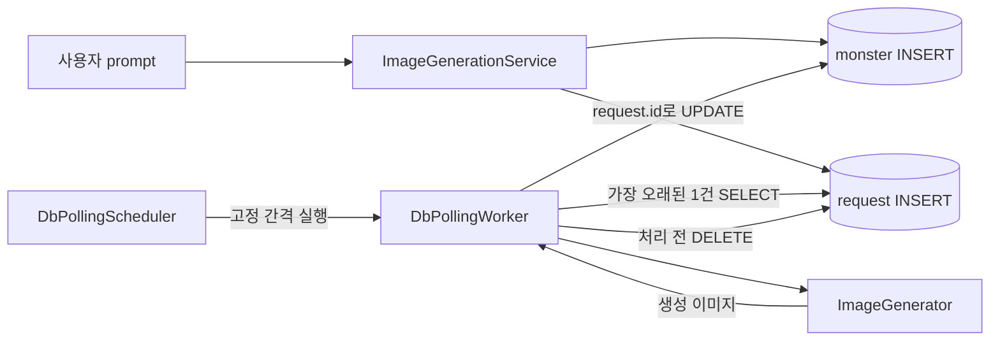

# 2. 최소 DB Polling 구현

상태: **작성 완료**

## 결론 🎯

**채택:** Java 21, Spring JDBC, H2로 정상 흐름만 수행하는 최소 DB Polling 구조를 구현했다. 요청 행의 존재를 대기 상태로 사용하고, 워커는 가장 오래된 요청 한 건을 삭제한 뒤 이미지를 생성한다.

**보류:** 상태, 원자적 선점, 타임아웃, 재시도, 멱등성은 4단계 범위다. 이번 구현은 안정적인 운영 구조가 아니라 3단계 실패 테스트의 기준선이다.

## 구현 범위

| 구성 요소 | 책임 | 구현 |
| --- | --- | --- |
| `monster` | 사용자 요청과 최종 이미지 저장 | `id`, `prompt`, `image` |
| `image_generation_request` | 처리 대기 요청 저장 | `id`, `prompt`, `created_at` |
| `ImageGenerationService` | 두 테이블에 요청 등록 | `monster` 저장 후 요청 enqueue |
| `DbPollingScheduler` | 고정 간격으로 워커 실행 | 단일 스레드 `scheduleWithFixedDelay` |
| `DbPollingWorker` | 요청 조회·삭제·생성·결과 저장 | 한 번에 최대 1건 처리 |

구현 코드는 [`refactoring-practice/src/main/java/com/kng0501/dbpolling`](../../refactoring-practice/src/main/java/com/kng0501/dbpolling)에 위치한다. 스키마는 [`schema.sql`](../../refactoring-practice/src/main/resources/db/schema.sql)에 위치한다.

## 정상 처리 흐름 🔄

1. 서비스가 `monster` 행을 먼저 만들고 이미지 생성 요청을 enqueue한다.
2. 스케줄러가 설정된 간격마다 `pollOnce()`를 호출한다.
3. 워커가 가장 오래된 요청 한 건을 조회하고 즉시 삭제한다.
4. 워커가 프롬프트로 이미지를 생성한다.
5. `request.id`와 같은 ID의 `monster.image`를 갱신한다.

📌 요청이 없으면 `pollOnce()`는 `false`를 반환한다. 요청이 있으면 한 건만 처리하고 `true`를 반환한다.

## 최소 구현에서 의도적으로 남긴 제약 ⚠️

| 지점 | 현재 동작 | 다음 검증 대상 |
| --- | --- | --- |
| 작업 상태 | 요청 행의 존재만으로 대기를 표현 | 실행 중·성공·실패를 구분할 수 있는가 |
| 작업 선점 | `SELECT`와 `DELETE`가 분리됨 | 두 워커가 같은 행을 읽을 수 있는가 |
| 워커 종료 | 생성 전에 요청 행을 삭제함 | 삭제 직후 종료되면 작업이 유실되는가 |
| 결과 연결 | `request.id == monster.id`를 전제함 | 두 시퀀스가 어긋나면 다른 결과에 연결되는가 |
| 요청 등록 | 두 INSERT가 하나의 트랜잭션이 아님 | 두 번째 INSERT 실패 시 불완전 데이터가 남는가 |
| 오류 처리 | 스케줄러 실행 중 예외를 복구하지 않음 | 예외 뒤 polling이 중단되는가 |

ID 일치 전제와 삭제 후 처리는 운영 환경에서 **거부**할 설계다. 이번 단계에서는 실패를 결정적으로 재현하기 위해 그대로 유지했다.

## 제외한 선택

- 외부 메시지 큐: **거부.** 현재 실습의 DB Polling 제약을 벗어난다.
- Spring Boot·JPA: **거부.** 스키마와 SQL 동작을 직접 확인하기 어려워지고 최소 구현 범위를 키운다.
- 분산 잠금·상태 머신·재시도 라이브러리: **보류.** 실패 재현 전에 넣으면 3단계 검증 대상을 가린다.

## 검증 결과 ✅

`./gradlew test` 실행 결과 `BUILD SUCCESSFUL`.

| 테스트 | 개수 | 결과 |
| --- | ---: | --- |
| JDBC 저장·조회·삭제 | 2 | 통과 |
| 워커 정상 처리·빈 큐·주기 Polling | 3 | 통과 |
| 합계 | 5 | 실패 0 |

전체 부하와 장애 상황은 아직 측정하지 않았다. 3단계에서는 프로덕션 코드를 먼저 고치지 않고 중복 선점, 워커 종료, 결과 오연결을 실패 테스트로 고정한다.
