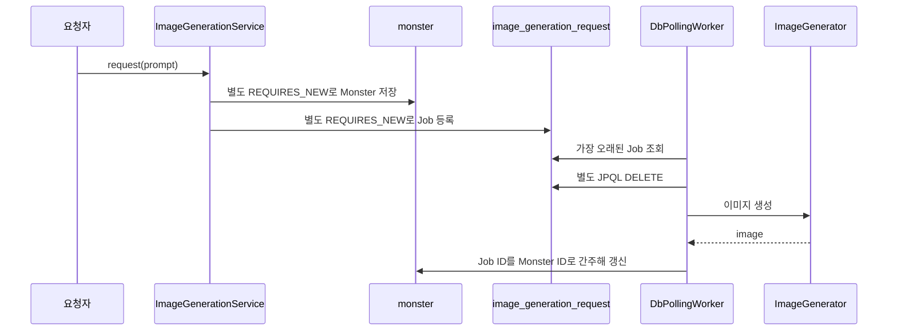

# 02. 최소 DB Polling 구조 재구성

## 결론 🧭

2025년 당시 안정화 이후 구조와 유사한 DB Polling 흐름을 Spring Boot와 Spring Data JPA로 이식했다. 이 코드는 과거 소스의 완전한 복원이 아니라, 현재 신뢰성 문제를 테스트하기 위한 `baseline` 기준 구현이다.

**유지:** JPA 전환으로 기존 결함을 고치지 않았다. 등록 전체 트랜잭션, 작업 상태, 원자적 선점, 명시적인 Monster 연결 키, Scheduler 예외 격리는 없다.

## 프로필과 스캔 경계

`baseline` 프로필에서만 02단계 컴포넌트·엔티티·Repository를 등록한다.

```text
BaselineProfileConfiguration
├── ComponentScan: com.kng0501.dbpolling.application, persistence
├── EntityScan: com.kng0501.dbpolling.persistence.entity
└── EnableJpaRepositories: com.kng0501.dbpolling.persistence.jpa
```

`@Entity`에 `@Profile`을 붙여 분리를 가정하지 않는다. `hardened` 프로필의 컴포넌트, 엔티티, Repository는 baseline 컨텍스트에 등록되지 않는다. 두 큐 프로필의 동시 활성화는 거부한다.

## 최소 처리 흐름 🔄



## JPA 구성

| 역할 | 구현 |
| --- | --- |
| 엔티티 | `BaselineMonsterEntity`, `BaselineImageGenerationRequestEntity` |
| Spring Data Repository | `BaselineMonsterJpaRepository`, `BaselineImageGenerationRequestJpaRepository` |
| 도메인 포트 어댑터 | `JpaMonsterRepository`, `JpaImageGenerationRequestRepository` |
| 서비스 | `ImageGenerationService` |
| 실행 | `DbPollingWorker`, `DbPollingScheduler` |
| 스키마 | [`db/baseline/schema.sql`](./src/main/resources/db/baseline/schema.sql) |

엔티티는 `IDENTITY`를 사용해 MySQL `AUTO_INCREMENT`와 맞춘다. 이미지 결과는 `TEXT`, 생성 시각은 UTC `DATETIME(6)`로 저장한다.

## 실패 의미를 보존한 방법 ⚠️

### 등록 원자성 없음

`ImageGenerationService`에는 `@Transactional`을 적용하지 않는다. Monster 저장과 Job 등록 어댑터가 각각 `REQUIRES_NEW`로 완료된다. Job INSERT가 실패해도 먼저 커밋한 Monster는 롤백되지 않는다.

### 조회와 삭제 분리

`findOldest()`가 반환한 DTO는 소유권이 아니다. 삭제는 다음 JPQL 벌크 연산으로 별도 실행한다.

```java
@Modifying(flushAutomatically = true, clearAutomatically = true)
@Query("delete from BaselineImageGenerationRequestEntity request where request.id = :requestId")
int deleteRequestById(long requestId);
```

Worker는 삭제 행 수를 확인하지 않는다. 두 Worker가 같은 행을 조회하면 한 Worker의 DELETE가 `0`행이어도 두 실행 모두 Generator로 진행한다.

### 처리 전 삭제와 결과 오연결

Job은 이미지 생성 전에 삭제된다. Generator 실패 이후 복구할 상태가 없다. Job에는 `monster_id`가 없으며 Worker는 Job ID를 Monster ID로 사용한다.

### Scheduler 예외 전파

`DbPollingScheduler`는 Spring이 관리하는 `SmartLifecycle` 빈이지만 내부 반복은 기존 `ScheduledExecutorService.scheduleWithFixedDelay(worker::pollOnce)`를 유지한다. Worker 예외가 바깥으로 전파되면 JDK Scheduler가 이후 반복 실행을 중단한다. `@Scheduled`로 바꿔 실패 의미를 제거하지 않았다.

## 테스트 기준 ✅

정상 테스트는 Spring이 생성한 서비스·JPA Repository와 전용 MySQL 테스트 DB를 사용한다. 테스트 클래스 전체를 트랜잭션으로 감싸지 않는다. Worker와 Scheduler의 실제 트랜잭션 경계를 그대로 관찰한다.

```bash
./gradlew test --rerun-tasks
```

기존 기본 동작 5개와 baseline 프로필 격리 검증을 정의했다. 2026-09-08 현재 테스트 코드는 컴파일됐지만 로컬 MySQL 인증 정보가 없어 실제 실행 결과는 **확인 필요**다.

## 다음 단계

[03단계](../03-failure-reproduction/README.md)는 위 JPA 기준 구현에서 다섯 신뢰성 불변식을 RED 테스트로 재현한다. 해결 코드는 04단계에만 둔다.
