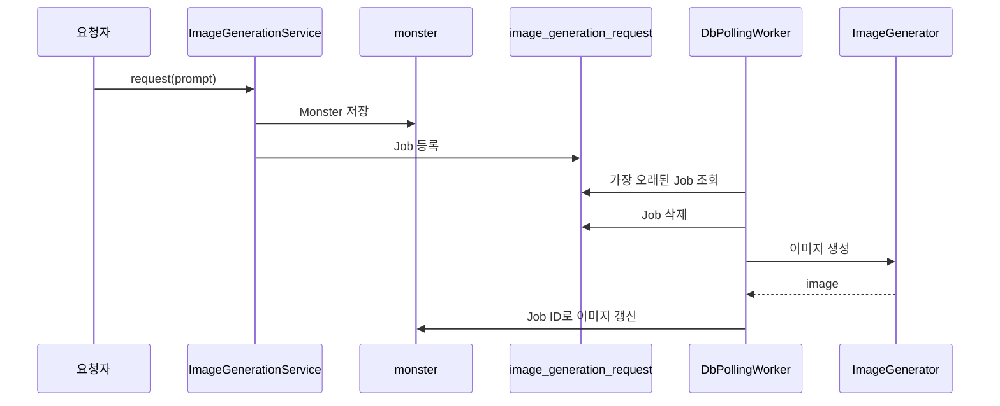

# 02. 최소 DB Polling 구조 재구성

## 결론 🧭

2025년 당시 안정화 이후 구조와 유사한 DB Polling 흐름을 최소 코드로 재구성했다. 이 코드는 과거 소스의 완전한 복원이 아니라, 현재 신뢰성 문제를 테스트하기 위한 기준 구현이다.

Java 21, Spring JDBC, H2, JUnit 5를 유지했다. JPA와 Spring Boot 전체 환경은 도입하지 않았다.

## 프로젝트 경계

`technical-writing` 디렉터리에서 Gradle Wrapper를 직접 실행한다. 소스는 02단계 아래에, 실패 재현 테스트는 03단계 아래에 유지한다.

```text
technical-writing/
├── build.gradle
├── settings.gradle
├── gradlew
├── 02-minimal-db-polling/src/main
├── 02-minimal-db-polling/src/test
└── 03-failure-reproduction/src/test
```

`refactoring-practice`의 외부 `sourceSets` 연결은 사용하지 않는다.

## 최소 처리 흐름 🔄



## 구성 요소

| 구성 요소 | 현재 역할 | 근거 파일 |
| --- | --- | --- |
| `ImageGenerationService` | Monster 저장 후 Job 등록 | [`ImageGenerationService.java`](./src/main/java/com/kng0501/dbpolling/application/ImageGenerationService.java) |
| `DbPollingScheduler` | `scheduleWithFixedDelay`로 Worker 반복 호출 | [`DbPollingScheduler.java`](./src/main/java/com/kng0501/dbpolling/application/DbPollingScheduler.java) |
| `DbPollingWorker` | 조회 → 삭제 → 생성 → 결과 반영 | [`DbPollingWorker.java`](./src/main/java/com/kng0501/dbpolling/application/DbPollingWorker.java) |
| JDBC 저장소 | Monster와 Job을 H2에 저장·조회 | [`persistence`](./src/main/java/com/kng0501/dbpolling/persistence) |
| 스키마 | `monster`, `image_generation_request` 두 테이블 정의 | [`schema.sql`](./src/main/resources/db/schema.sql) |

`image_generation_request`에는 `prompt`와 생성 시각만 있다. 작업 상태와 `monster_id` 연결 키는 없다.

## 정상 동작 기준 ✅

정상 테스트는 저장소와 단일 Worker·Scheduler의 기본 흐름만 확인한다.

```bash
cd technical-writing
./gradlew test
```

`failure-reproduction` 태그는 제외된다. 현재 정상 테스트는 총 5개다.

## 의도적으로 남긴 신뢰성 공백 ⚠️

| 공백 | 현재 코드의 근거 | 03단계에서 검증할 불변식 |
| --- | --- | --- |
| 원자적 선점 없음 | 조회와 삭제가 분리됨 | 한 작업은 한 Worker만 처리해야 함 |
| 처리 전 삭제 | 생성 전에 Job 행을 삭제함 | Worker 종료 후 미완료 작업이 남아야 함 |
| 명시적 결과 연결 없음 | Job ID를 Monster ID로 사용함 | 결과는 요청한 Monster에만 연결돼야 함 |
| 등록 트랜잭션 없음 | Monster 저장과 Job 등록이 별도 호출임 | 둘은 함께 저장되거나 함께 취소돼야 함 |
| 예외 격리 없음 | Scheduler에 `worker::pollOnce`를 직접 전달함 | 한 작업 실패가 이후 Polling을 중단하면 안 됨 |

이 공백은 현재 단계에서 해결하지 않는다. [03단계](../03-failure-reproduction/README.md)는 **과거 코드와 유사한 재구성에서 확인한 잠재적 신뢰성 문제**를 RED 테스트로 고정한다. 작업 상태, 원자적 선점, 처리 타임아웃 복구, 재시도, 멱등한 결과 반영은 4단계 범위다.
