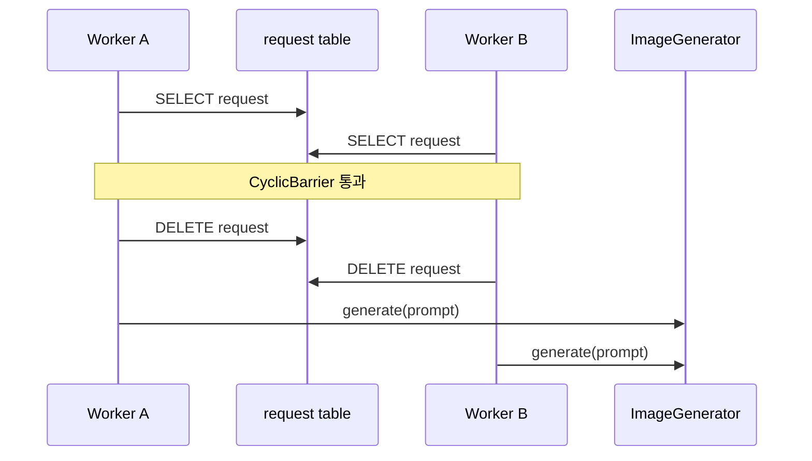

# 3. 실패 테스트 재현

상태: **작성 완료**

## 결론 🚨

**채택:** 전체 부하를 만들지 않고 요청 1건과 최대 워커 2개로 중복 선점, 워커 종료, 결과 오연결을 모두 재현했다. 프로덕션 코드 변경 0건. 세 테스트는 올바른 보장을 assertion으로 표현하므로 현재 구현에서 의도적으로 실패한다.

## 실행 분리

실패 재현 테스트에는 `failure-reproduction` 태그를 지정했다. 일반 회귀 테스트와 실행 결과를 섞지 않는다.

```bash
./gradlew test
./gradlew failureTest
```

| Gradle 작업 | 대상 | 결과 |
| --- | --- | --- |
| `test` | 기존 정상 흐름 5건 | 5 통과, 0 실패 |
| `failureTest` | 실패 재현 3건 | 0 통과, 3 실패 |

`failureTest`의 종료 코드 1은 이번 단계의 예상 결과다. 5단계에서는 같은 테스트와 같은 명령이 종료 코드 0을 반환해야 한다.

## 실패 1: 중복 선점 🧪

`SELECT`가 끝난 직후 두 워커를 `CyclicBarrier`에서 대기시켰다. 첫 워커가 요청을 삭제하기 전에 두 워커가 같은 요청을 읽도록 실행 순서를 고정했다.



| 검증값 | 기대 | 실제 |
| --- | ---: | ---: |
| 처리했다고 응답한 워커 | 1 | 2 |
| 이미지 생성 호출 | 1 | 2 |

`DELETE` 영향 행 수를 확인하지 않으므로 두 워커가 모두 처리를 계속한다. 부하 반복이나 임의의 `Thread.sleep` 없이 한 번에 재현된다.

## 실패 2: 워커 종료 ⚠️

요청 행을 삭제한 다음 이미지 생성기에서 `SimulatedWorkerStopException`을 발생시켰다. 이는 요청 삭제와 결과 저장 사이에서 워커가 종료되는 지점을 나타낸다.

| 검증값 | 기대 | 실제 |
| --- | ---: | ---: |
| 완료되지 않은 작업 행 | 1 | 0 |

작업 상태와 소유권 정보가 없고 처리 전에 행을 삭제하므로 다른 워커가 복구할 근거가 남지 않는다.

## 실패 3: 결과 오연결 🔗

요청과 무관한 `monster`를 먼저 저장해 두 테이블의 ID 시퀀스를 어긋나게 만들었다. 워커는 `request.id`를 `monster.id`로 사용하므로 잘못된 행을 갱신한다.

| 데이터 | ID | 처리 후 이미지 |
| --- | ---: | --- |
| 무관한 `monster` | 1 | `image:blue dragon` — 오류 |
| 요청 대상 `monster` | 2 | `null` — 오류 |
| `blue dragon` 요청 | 1 | 명시적 `monster_id` 없음 |

assertion은 무관한 `monster`의 이미지가 없어야 하고 요청 대상에 `image:blue dragon`이 저장돼야 한다고 요구한다. 현재 구현은 두 조건을 모두 위반한다.

## 테스트 위치

- [DuplicateClaimFailureTest](./src/test/java/com/kng0501/dbpolling/failure/DuplicateClaimFailureTest.java)
- [WorkerTerminationFailureTest](./src/test/java/com/kng0501/dbpolling/failure/WorkerTerminationFailureTest.java)
- [ResultMisconnectionFailureTest](./src/test/java/com/kng0501/dbpolling/failure/ResultMisconnectionFailureTest.java)

## 부정·제약

- 성능과 처리량은 **비범위**. 요청 수는 각 테스트당 1건이다.
- 실제 프로세스를 강제 종료하지 않는다. 이미지 생성 지점의 예외로 같은 실패 구간을 결정적으로 통제한다.
- barrier에는 교착 방지를 위한 1초 제한만 사용한다. 타이밍으로 경쟁 조건을 유도하지 않는다.
- 테스트가 현재의 잘못된 결과를 기대하도록 작성하는 방식은 **거부**. 수정 후에도 같은 보장을 검사하기 위해 올바른 결과를 assertion으로 유지한다.

## 4단계 연결 ✅

| 실패 | 다음 변경 |
| --- | --- |
| 중복 선점 | 상태와 원자적 선점 추가 |
| 워커 종료 | 실행 소유권·타임아웃·재시도 추가 |
| 결과 오연결 | 작업에 명시적 `monster_id`와 멱등성 키 추가 |

다음 단계에서는 세 RED 테스트를 수정하지 않고 프로덕션 구조를 변경한다.
