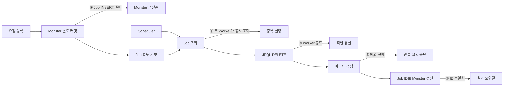

# 03. 잠재적 신뢰성 문제 재현

## 결론 🧪

02단계 JPA 기준 구현의 신뢰성 불변식 5개를 RED 테스트로 유지했다. 테스트는 Spring 빈과 로컬 MySQL 테스트 DB를 사용한다. H2나 JDBC 구현으로 우회하지 않는다.

이 결과는 **과거 코드와 유사한 재구성에서 확인하는 잠재적 신뢰성 문제**다. 과거 운영 장애에서 작업 유실이나 중복 실행이 실제로 발생했다는 증거가 아니다.

## 실행 조건

```bash
export TECHNICAL_WRITING_TEST_DB_URL='jdbc:mysql://127.0.0.1:3306/technical_writing_test?connectionTimeZone=UTC&forceConnectionTimeZoneToSession=true'
export TECHNICAL_WRITING_TEST_DB_USERNAME='test_user'
export TECHNICAL_WRITING_TEST_DB_PASSWORD='...'

./gradlew failureTest --rerun-tasks
```

모든 테스트에 `failure-reproduction` 태그를 적용했다. 기대 결과는 불변식 assertion 5개 실패와 Gradle 종료 코드 `1`이다. 접속·스키마·매핑 오류는 기대 결과가 아니다.

## 실패 지점 ⚠️



## RED 테스트 5개

| 사례 | 원하는 불변식 | 기준 구현의 실패 원인 | 04단계 해결 방향 |
| --- | --- | --- | --- |
| 중복 선점 | 한 작업은 한 Worker만 처리 | 조회와 DELETE가 분리되고 DELETE 0행을 무시 | 조건부 상태 UPDATE 1행만 실행 |
| Worker 종료 후 유실 | 미완료 작업은 복구 가능해야 함 | Generator 실행 전에 Job 삭제 | `RUNNING`과 처리 기한 보존 |
| 결과 오연결 | 결과는 요청한 Monster에만 연결 | Job ID를 Monster ID로 사용 | 명시적 FK 사용 |
| 등록 원자성 | Monster와 Job이 함께 커밋·롤백 | Repository별 `REQUIRES_NEW`, 서비스 트랜잭션 없음 | 동일 로컬 트랜잭션 |
| Scheduler 중단 | 한 작업 실패 후에도 Polling 지속 | Generator 예외가 JDK Scheduler 경계 밖으로 전파 | 작업 실패 전환과 Scheduler 예외 격리 |

### 1. 중복 선점

두 Worker가 실제 JPA Repository의 `findOldest()`를 마친 뒤 `CyclicBarrier`에서 합류한다. 이후 각 Worker가 별도 JPQL DELETE를 실행한다. 삭제 행 수를 소유권으로 사용하지 않으므로 처리 Worker와 Generator 호출 수가 각각 기대 `1`, 기준 구현 `2`가 되어야 한다.

### 2. Worker 종료 후 작업 유실

실제 Worker의 Generator에 예외를 주입한다. Job DELETE는 이미 커밋됐기 때문에 남은 Job 수가 기대 `1`, 기준 구현 `0`이 되어야 한다. 이 테스트는 유실만 증명하며 타임아웃 복구를 검증하지 않는다.

### 3. 결과 오연결

Monster AUTO_INCREMENT를 Job ID보다 먼저 증가시킨다. Worker가 Job ID로 갱신하면 무관한 Monster의 이미지 존재 여부가 기대 `false`, 기준 구현 `true`가 되고 대상 이미지는 기대 `image:blue dragon`, 기준 구현 `null`이 되어야 한다.

### 4. 등록 원자성

테스트 DB에 Job prompt를 거부하는 CHECK 제약을 일시적으로 추가한다. 실제 `ImageGenerationService`를 호출해 Monster INSERT 성공 후 Job INSERT 실패를 만든다. 요청 실패 후 Monster 수가 기대 `0`, 기준 구현 `1`이 되어야 한다. 테스트 종료 전 임시 제약은 제거한다.

### 5. Scheduler 반복 중단

테스트 전용 Generator 빈이 첫 호출에서 예외를 던진다. `scheduleWithFixedDelay`의 이후 실행이 중단된 뒤 나중 Job을 등록한다. 특정 후속 Job 처리 여부가 기대 `true`, 기준 구현 `false`이고 대기 Job 수가 기대 `0`, 기준 구현 `1`이어야 한다.

## 동시성과 정리 원칙

- 경합 재현은 `CyclicBarrier`와 `CountDownLatch`를 사용한다.
- 실제 스레드 완료 관찰에만 제한 시간이 있는 `await`를 사용한다.
- 경쟁 상태나 처리 기한을 만들기 위한 `Thread.sleep`은 사용하지 않는다.
- Executor와 Scheduler는 테스트 종료 시 정리한다.
- 테스트 클래스 전체에 `@Transactional`을 적용하지 않는다.
- baseline 전용 테스트 DB의 `monster`, `image_generation_request`만 명시적으로 정리한다.

## 검증 상태

과거 JDBC/H2 실행에서는 다섯 assertion 실패를 확인했다. 이번 Spring Data JPA/MySQL 이식은 컴파일까지 완료했다. 2026-09-08 실행에서는 5개 모두 미설정 JDBC URL로 컨텍스트 초기화에 실패했다. 이는 기대한 RED 결과가 아니다. MySQL 인증 정보 제공 후 동일한 실제 실패 값과 SQL 확인이 필요하다.
