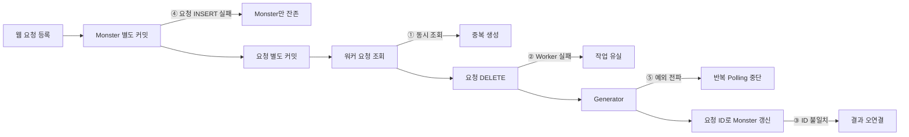

# 03. 잠재적 신뢰성 문제 재현

## 결론 🧪

**유지:** 02단계의 최소 DB Polling 코드가 정상 상황에서는 동작해도, 웹 서버와 별도 워커가 MySQL을 함께 사용할 때 다섯 신뢰성 불변식을 지키지 못함을 RED 테스트로 재현한다.

이 테스트는 **과거 구조를 현재 코드로 재구성해 발견한 잠재적 실패**다. 과거 운영 장애에서 유실·중복·오연결이 실제로 발생했다는 증거가 아니다.

## 실행

```bash
export TECHNICAL_WRITING_TEST_DB_URL='jdbc:mysql://127.0.0.1:3306/technical_writing_test?connectionTimeZone=UTC&forceConnectionTimeZoneToSession=true'
export TECHNICAL_WRITING_TEST_DB_USERNAME='test_user'
export TECHNICAL_WRITING_TEST_DB_PASSWORD='...'

./gradlew failureTest --rerun-tasks
```

동시 선점·유실·오연결·Scheduler 중단 테스트는 `com.kng0501.dbpolling.worker.ImageWorkerApplication` Worker Context를 사용한다. 등록 원자성 테스트는 `com.kng0501.dbpolling.server.WebServerApplication` Server Context를 사용한다. 역할을 고르기 위한 Spring Profile은 사용하지 않는다.

각 Context는 상대 프로세스의 Java Bean·Entity·Repository를 등록하지 않는다. RED 시나리오가 관찰하는 프로세스 간 계약은 MySQL 테이블뿐이다.

기대 결과는 다섯 불변식 assertion 실패와 Gradle 종료 코드 `1`이다. DB 접속, Context 초기화, JPA 매핑 오류는 RED 재현 성공이 아니다.

## 실패 지점 ⚠️



## RED 테스트 5개

| 사례 | 원하는 불변식 | 기준 구현의 실제 실패 원인 | 04단계 대응 |
| --- | --- | --- | --- |
| 동시 선점 | 한 작업은 한 Worker만 생성 | 조회·DELETE 분리, DELETE 0행 무시 | 조건부 상태 UPDATE 1행 확인 |
| Worker 종료 후 유실 | 미완료 작업은 이후 복구 가능 | 생성 전에 요청 행 삭제 | `RUNNING`·처리 기한·복구 |
| 결과 오연결 | 결과는 요청한 Monster에만 연결 | 요청 ID를 Monster ID로 사용 | Job의 명시적 Monster FK |
| 요청 등록 비원자성 | Monster와 작업이 함께 커밋·롤백 | Repository별 `REQUIRES_NEW` | 같은 로컬 트랜잭션 |
| Scheduler 중단 | 한 작업 실패 뒤에도 Polling 지속 | 예외가 `scheduleWithFixedDelay` 경계 밖으로 전파 | 실패 전환과 Scheduler 경계 격리 |

### 동시 선점

두 Worker는 실제 JPA `findOldest()` 뒤 `CyclicBarrier`에서 합류한다. 각각 DELETE를 시도하고 행 수를 확인하지 않으므로 Generator 호출 수는 기대 1, 기준 구현 2가 된다.

### Worker 종료 후 유실

Generator 예외는 요청 DELETE 뒤 발생한다. 남은 요청 수는 기대 1, 기준 구현 0이다. 이 테스트는 복구가 아니라 유실만 증명한다.

### 결과 오연결

Monster AUTO_INCREMENT와 요청 ID를 의도적으로 어긋나게 만든다. 기준 Worker는 대상이 아닌 Monster를 갱신할 수 있다.

### 요청 등록 비원자성

요청 INSERT를 거부하는 임시 CHECK 제약으로 Monster 저장 성공 뒤 작업 등록 실패를 만든다. 요청 전체 실패 뒤 Monster 수는 기대 0, 기준 구현 1이다.

### Scheduler 중단

첫 Generator 호출이 예외를 던진다. 이후 등록한 특정 작업이 완료되어야 한다는 불변식이 기준 구현에서 실패한다. 단순 Generator 호출 횟수로 후속 처리 여부를 판단하지 않는다.

## 동시성과 정리 원칙

- 경합 순서는 `CyclicBarrier`, `CountDownLatch`로 통제한다.
- 실제 스레드 관찰에는 제한 시간이 있는 `await`만 사용한다.
- 경쟁 상태를 만들기 위한 `Thread.sleep`은 사용하지 않는다.
- Executor와 Scheduler는 테스트 종료 시 정리한다.
- 테스트 클래스 전체에 `@Transactional`을 적용하지 않는다.

## 검증 상태

2026-09-09 기준 `./gradlew failureTest --rerun-tasks`는 5건 모두 전용 `${TECHNICAL_WRITING_TEST_DB_URL}` 미설정으로 Context 초기화에서 실패했다. 이는 RED 재현 성공이 아니다. 인증 후에는 Context 오류가 아닌 위 assertion에서만 실패하는지 확인해야 한다.
