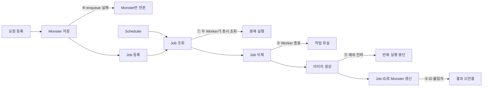

# 03. 잠재적 신뢰성 문제 재현

## 결론 🧪

현재 재구성 코드의 신뢰성 불변식 5개를 RED 테스트로 고정했다. `failureTest`의 5개 실패는 모두 컴파일·설정·준비 단계 오류가 아니라 원하는 불변식 assertion에서 발생한다.

이 결과는 **과거 코드와 유사한 재구성에서 확인한 잠재적 신뢰성 문제**다. 과거 운영 장애에서 작업 유실이나 중복 실행이 실제로 발생했다는 증거는 아니다.

## 테스트 분리

```bash
cd technical-writing
./gradlew test         # 정상 테스트 5개, 성공 기대
./gradlew failureTest  # RED 테스트 5개, 종료 코드 1 기대
```

모든 RED 테스트에 `failure-reproduction` 태그를 적용했다. 동시성 재현에는 `CyclicBarrier`와 `CountDownLatch`를 사용한다. 경쟁 상태를 만들기 위한 `Thread.sleep`은 사용하지 않는다. Executor와 Scheduler는 테스트 종료 시 정리한다.

## 실패 지점 개요 ⚠️



## 1. 두 Worker의 동일 작업 중복 선점

- **원하는 불변식**: 작업 한 건은 한 Worker만 처리하고, 이미지 생성도 한 번만 호출해야 한다.
- **현재 실제 결과**: 처리했다고 응답한 Worker는 기대 `1`명, 실제 `2`명이다. 이미지 생성 호출도 기대 `1`회, 실제 `2`회다.
- **실패 이유**: 두 Worker가 `findOldest()`를 완료한 뒤 `CyclicBarrier`에서 합류한다. 조회와 삭제 사이에 원자적 선점이 없어 둘 다 같은 행을 확보한다.
- **4단계 해결 방향**: 작업 상태와 원자적 선점을 추가하고, 한 행의 소유권을 한 Worker에게만 부여한다.
- **테스트**: [`DuplicateClaimFailureTest.java`](./src/test/java/com/kng0501/dbpolling/failure/DuplicateClaimFailureTest.java)

## 2. Worker 종료 후 작업 유실

- **원하는 불변식**: Worker가 처리 중 종료돼도 완료되지 않은 작업 행은 남아야 한다.
- **현재 실제 결과**: 남은 Job 수는 기대 `1`, 실제 `0`이다.
- **실패 이유**: Worker가 이미지 생성 전에 Job을 삭제한다. 삭제 후 Generator 예외가 발생하면 다시 처리할 행이 없다.
- **4단계 해결 방향**: `RUNNING` 상태와 처리 기한을 저장하고, 기한이 지난 작업을 재시도 대상으로 돌린다.
- **테스트**: [`WorkerTerminationFailureTest.java`](./src/test/java/com/kng0501/dbpolling/failure/WorkerTerminationFailureTest.java)

이 테스트의 현재 범위는 **유실 증명**뿐이다. 타임아웃 복구 동작은 검증하지 않는다.

## 3. Job과 Monster ID 불일치로 결과 오연결

- **원하는 불변식**: 생성 결과는 요청한 Monster에만 연결돼야 한다.
- **현재 실제 결과**: 무관한 Monster의 `hasImage`는 기대 `false`, 실제 `true`다. 대상 Monster 이미지는 기대 `image:blue dragon`, 실제 `null`이다.
- **실패 이유**: Job에 `monster_id`가 없다. Worker가 Job ID를 Monster ID로 간주해 갱신한다.
- **4단계 해결 방향**: Job에 명시적 `monster_id`를 저장하고, 완료 반영을 해당 작업과 Monster에 대해 멱등하게 만든다.
- **테스트**: [`ResultMisconnectionFailureTest.java`](./src/test/java/com/kng0501/dbpolling/failure/ResultMisconnectionFailureTest.java)

## 4. Monster 저장과 Job 등록의 원자성 실패

- **원하는 불변식**: Monster와 이미지 생성 Job은 함께 저장되거나 함께 저장되지 않아야 한다.
- **현재 실제 결과**: enqueue 실패 후 Monster 수는 기대 `0`, 실제 `1`이다. Job 수는 기대와 실제 모두 `0`이다.
- **실패 이유**: `ImageGenerationService.request()`에 두 저장 연산을 묶는 트랜잭션 경계가 없다. 첫 저장은 두 번째 저장 실패와 무관하게 커밋된다.
- **4단계 해결 방향**: Monster 저장과 Job 등록을 하나의 로컬 트랜잭션으로 묶는다.
- **테스트**: [`RequestRegistrationAtomicityFailureTest.java`](./src/test/java/com/kng0501/dbpolling/failure/RequestRegistrationAtomicityFailureTest.java)

## 5. 한 작업의 예외로 Scheduler 반복 실행 중단

- **원하는 불변식**: 한 작업의 실패가 이후 Polling 실행을 중단해서는 안 된다.
- **현재 실제 결과**: 나중 Job 처리 여부는 기대 `true`, 실제 `false`다. 대기 Job 수는 기대 `0`, 실제 `1`이다.
- **실패 이유**: Generator 예외가 `pollOnce()`와 Scheduler 실행 경계 밖으로 전파된다. `scheduleWithFixedDelay`의 해당 반복 작업은 이후 실행이 억제된다.
- **4단계 해결 방향**: 작업 단위 예외를 Scheduler 경계 안에서 격리하고, 실패 상태와 재시도 정책으로 넘긴다.
- **테스트**: [`SchedulerContinuityFailureTest.java`](./src/test/java/com/kng0501/dbpolling/failure/SchedulerContinuityFailureTest.java)

첫 실행 확인과 후속 처리 관찰에는 제한 시간이 있는 `CountDownLatch.await`를 사용한다. 테스트의 Scheduler는 `try-with-resources`로 종료한다.

## 4단계 검증 원칙 ⏱️

처리 타임아웃 테스트에는 `java.time.Clock`을 주입한다. 시간 경과를 재현하기 위한 `Thread.sleep`은 사용하지 않는다. 고정하거나 제어 가능한 Clock을 전진시켜 만료와 복구를 결정적으로 검증한다.

## 부정·제약

- 각 RED 테스트는 한 건의 작업과 최대 두 Worker로 불변식만 검증한다. 전체 부하 측정이 아니다.
- 실제 프로세스 강제 종료를 실행하지 않는다. Generator 예외로 삭제 이후 중단 지점을 재현한다.
- Worker 종료 테스트는 처리 타임아웃 복구를 검증하지 않는다.
- 작업 상태, 원자적 선점, 타임아웃 복구, 재시도, 멱등 처리는 아직 구현하지 않았다.
- 300개 작업의 완료·유실·중복 측정은 6단계 범위다.
