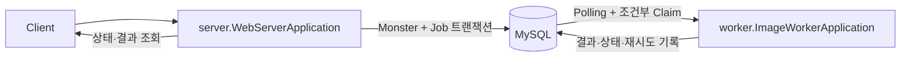
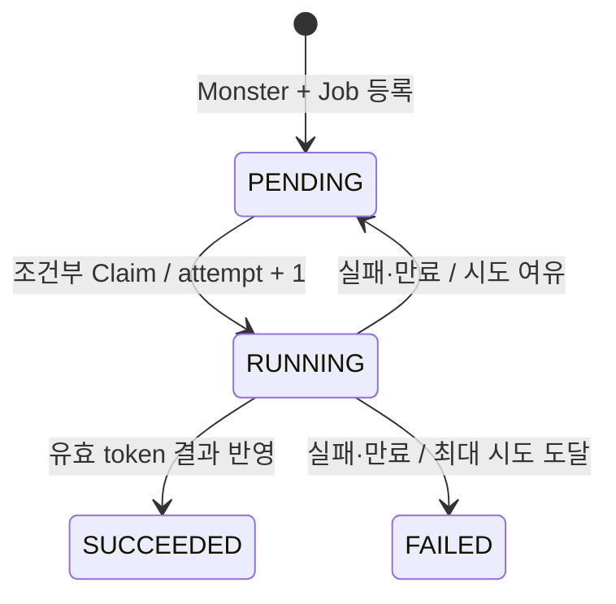
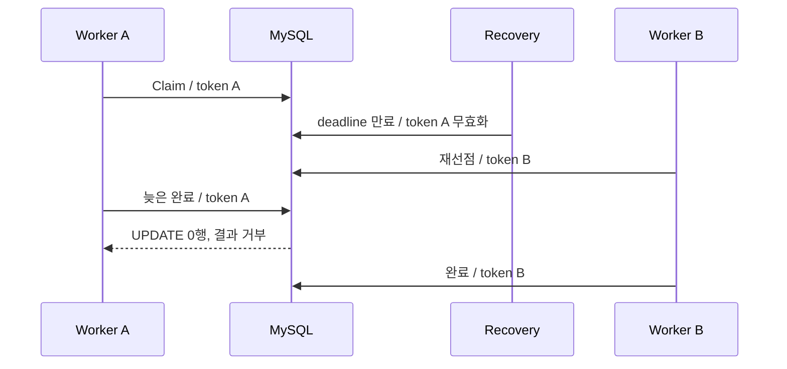

# 04. DB Job Queue 신뢰성 개선

## 결론 🧭

**채택:** 02와 같은 외부 구조를 유지하고 DB Job Queue의 신뢰성 규칙만 추가한다. `com.kng0501.dbqueue.server.WebServerApplication`은 요청 등록·조회, `com.kng0501.dbqueue.worker.ImageWorkerApplication`은 Polling·선점·생성·완료·실패·복구를 담당하는 별도 JVM이다.

**보장 범위:** 중복 실행 자체를 완전히 없애지 않는다. 처리 기한 만료 뒤 같은 Job이 재실행될 수 있음을 전제로, 유효한 `claimToken`만 최종 결과를 반영하게 한다. “Exactly Once”는 주장하지 않는다.



## Application과 Bean 경계

| Application | 등록 Bean | 등록하지 않는 Bean |
| --- | --- | --- |
| `server.WebServerApplication` | Controller, `JobRegistrationService`, `JobQueryService`, Server 전용 Monster·Job Entity·Repository, Server 전용 `JobStatus`, `Clock` | `JobWorker`, `JobScheduler`, `ImageGenerator`, Executor, Polling·복구 작업 |
| `worker.ImageWorkerApplication` | Worker 전용 Job Entity·Repository·`JobStatus`, `JobQueue`, `JobWorker`, `JobScheduler`, `JobPollingTasks`, `ExpiredJobRecovery`, `ExpiredJobTransition`, `ImageGenerator`, Executor, Scheduler | Controller, HTTP 서버, Monster Entity·Repository |

웹 Application은 `JobRegistrationService`, `JobQueryService`만으로 등록·조회한다. Worker는 `WebApplicationType.NONE`으로 시작하며 HTTP 포트를 열지 않는다. Server와 Worker는 Java 클래스를 공유하지 않으며 `queue_monster`, `image_generation_job` 스키마가 최종 계약이다.

```bash
# 터미널 1
./gradlew run04WebServer

# 터미널 2
./gradlew run04ImageWorker
```

## 03단계 실패와 대응

| 03단계 잠재적 실패 | 04단계 규칙 | 구현 근거 |
| --- | --- | --- |
| 동일 작업 중복 선점 | `PENDING` 조건부 UPDATE가 1행일 때만 실행 | `ImageGenerationJobJpaRepository.claim` |
| 처리 전 삭제 뒤 유실 | Job 보존, 만료 `RUNNING` 재시도 또는 `FAILED` | `ExpiredJobRecovery`, `ExpiredJobTransition` |
| 결과 오연결 | Job의 명시적 `monster_id` 사용 | Worker `ImageGenerationJobEntity.monsterId`, native UPDATE |
| Monster·Job 등록 비원자성 | 동일 트랜잭션에서 함께 저장 | `JobRegistrationService.request` |
| 한 작업 예외로 Scheduler 중단 | Job 실패 전환, Scheduler 경계 예외 격리 | `JobWorker`, `JobPollingTasks` |

03의 RED 테스트를 hardened 구현에 그대로 이식하는 전체 회귀는 05단계 범위다.

## 상태와 데이터 모델 🔄



| 필드 | 역할 |
| --- | --- |
| `job_id` | 작업 식별자와 결과 멱등성 범위 |
| `monster_id` | 결과 대상 FK |
| `status` | `PENDING`, `RUNNING`, `SUCCEEDED`, `FAILED` |
| `attempt_count` | 성공적으로 선점할 때만 증가. 최초 실행 포함 |
| `next_attempt_at` | 다음 실행 가능 시각 |
| `deadline_at` | 현재 선점의 고정 처리 기한 |
| `claim_token` | 선점마다 새로 발급하는 실행 소유권 |
| `created_at`, `started_at`, `finished_at` | 생성·선점·종결 시각 |
| `last_error` | 마지막 실패 원인 |

`SUCCEEDED`, `FAILED` Job은 자동 재실행하지 않고 검증·측정을 위해 보존한다. Server는 등록·조회에 필요한 단방향 `ManyToOne(fetch = LAZY)`를 가진다. Worker는 `monster_id`를 `Long monsterId`로만 매핑하며 `Monster` Entity·Repository·`ManyToOne`을 갖지 않는다. Worker 완료는 Job 상태 조건부 UPDATE 뒤 `UPDATE queue_monster SET image = :image WHERE monster_id = :monsterId`를 실행한다. 양방향 연관관계, `CascadeType.ALL`, `orphanRemoval`은 사용하지 않는다.

## 트랜잭션과 선점 🔒

| 연산 | 경계 | 핵심 규칙 |
| --- | --- | --- |
| 등록 | `JobRegistrationService.request`, `REQUIRES_NEW` | Monster persist와 Job persist·flush를 함께 커밋 |
| 선점 | `JobQueue.tryClaim`, `REQUIRES_NEW` | `PENDING`, `next_attempt_at <= now`, 시도 여유를 조건으로 UPDATE |
| 완료 | `JobQueue.complete`, `REQUIRES_NEW` | `RUNNING`, token, 유효 기한을 확인하고 Job 완료·Monster 이미지 갱신을 함께 커밋 |
| 실패 | `JobQueue.fail`, `REQUIRES_NEW` | token·상태·시도·기한을 확인해 재시도 또는 `FAILED` |
| 만료 복구 | `ExpiredJobTransition.recover`, `REQUIRES_NEW` | 만료된 동일 token의 Job만 재시도 또는 종결 |

후보 SELECT는 소유권이 아니다. 후보 ID를 읽은 뒤 조건부 UPDATE 영향 행이 1인 Worker만 Generator를 호출한다. 영향 행이 0이면 실행하지 않는다. 경합 비용은 패배 Worker의 SELECT·UPDATE 왕복과 다음 Polling까지의 지연이다.

```text
후보 ID 조회
  → 조건부 UPDATE 1행 확인
  → 영속성 컨텍스트 clear
  → 불변 Job DTO 재조회
  → 선점 트랜잭션 커밋
  → Generator 실행
  → 별도 완료·실패 트랜잭션
```

이미지 생성 중 DB 트랜잭션과 행 잠금을 유지하지 않는다. 벌크 UPDATE는 `flushAutomatically`, `clearAutomatically`를 사용하고, 이후 오래된 Entity를 재사용하지 않는다.

## 늦은 결과, 타임아웃, 재시도 ⏱️



기한 만료는 Generator 스레드를 자동 중단하지 않는다. 오래된 실행의 완료·실패 전환은 token 조건으로 거부한다. 결과 멱등성은 동일 `job_id`의 최종 DB 반영 범위이며, Generator 호출 횟수 1회를 보장하지 않는다.

| 설정 | 기본값 | 판단 |
| --- | ---: | --- |
| 모의 이미지 생성 | 5초 | 02와 동일한 관찰용 지연 |
| 처리 기한 | 30초 | 5초보다 충분히 긴 실습용 고정값. 운영 적정값 아님 |
| 최대 시도 | 3회 | 최초 실행 포함 |
| 재시도 간격 | 1초 | 고정 간격. backoff·jitter 없음 |
| Polling·복구 간격 | 100ms | 실습 관찰용 |
| 워커 동시 처리 | 1 | 02와 동일한 기본 비교 조건 |

상태 판단 시각은 주입한 `Clock`에서 얻어 마이크로초 단위로 맞춘다. 테스트는 `TestClock`을 전진시키며 타임아웃·재시도를 재현한다. 시간 경과 재현에 `Thread.sleep`을 사용하지 않는다. Heartbeat는 비범위다.

## Scheduler와 실행 용량 ⚙️

- `JobPollingTasks`가 Polling과 만료 복구를 분리한다.
- 제어용 `ThreadPoolTaskScheduler`는 Generator와 별도이므로 긴 생성이 복구를 막지 않는다.
- `ThreadPoolExecutor`와 Semaphore는 `concurrency`만큼만 선점하도록 제한한다.
- 제출 거부는 실패·재시도 전환으로 연결한다. DB 기록까지 실패하면 `RUNNING`과 기한을 남겨 이후 복구한다.
- 작업 예외는 Job 실패로 기록한다. Scheduler 경계 예외도 SLF4J로 기록하고 다음 반복을 유지한다.
- 종료 시 `JobScheduler.close()`가 실행 풀과 대기 작업을 정리한다.

동시 실행 상한은 Worker JVM 하나의 상한이다. 여러 워커 프로세스 전체의 전역 상한은 제공하지 않는다.

## MySQL·JPA 기준

스키마는 [`db/04/schema.sql`](./src/main/resources/db/04/schema.sql)이다. `AUTO_INCREMENT`, InnoDB FK·CHECK, 준비·만료 조회 인덱스, `claim_token CHAR(36)`, UTC `DATETIME(6)`을 명시한다.

웹과 워커는 같은 DB URL을 사용하지만 각자 Hikari Pool을 만든다. 기본 상한은 JVM당 5개, 두 프로세스 합산 10개다. 애플리케이션 시작 DDL은 끄고, 루트 README의 명령으로 스키마를 한 번 적용한다. `ddl-auto=validate`는 유지한다.

Worker에는 영속 Entity나 LAZY proxy를 넘기지 않고 불변 `Job` DTO만 전달한다. Worker Job 매핑에는 Monster 연관관계가 없으므로, 결과 대상은 항상 DTO의 `monsterId`와 native UPDATE로 처리한다. FetchType만으로 SQL을 추측하지 않고 `JpaPersistenceContractTest`에서 필요한 SQL 형태를 확인한다.

## 검증 상태

등록 롤백, 조건부 선점, 결과 연결, 중복·오래된 token 거부, 만료·재시도·최대 시도, Scheduler 후속 Job 처리, web Context의 Worker Bean 미등록 테스트를 작성했다.

2026-09-09 기준 `./gradlew clean compileJava compileTestJava`는 성공했다. 리팩터링 뒤 `./gradlew test --rerun-tasks`와 `./gradlew failureTest --rerun-tasks`는 전용 `${TECHNICAL_WRITING_TEST_DB_URL}` 미설정으로 보류했다. 실제 SQL, 잠금·격리, 통합 테스트, 두 JVM 재시작·복구 검증은 확인 필요다. H2로 대체하지 않았다.

## 비범위

Heartbeat, 메시지 브로커, MySQL Testcontainers, 실제 Python AI Worker·GCS, HTTP 외 API, SSE, ETA, 05 전체 회귀, 06의 300개 작업 측정은 비범위다.
