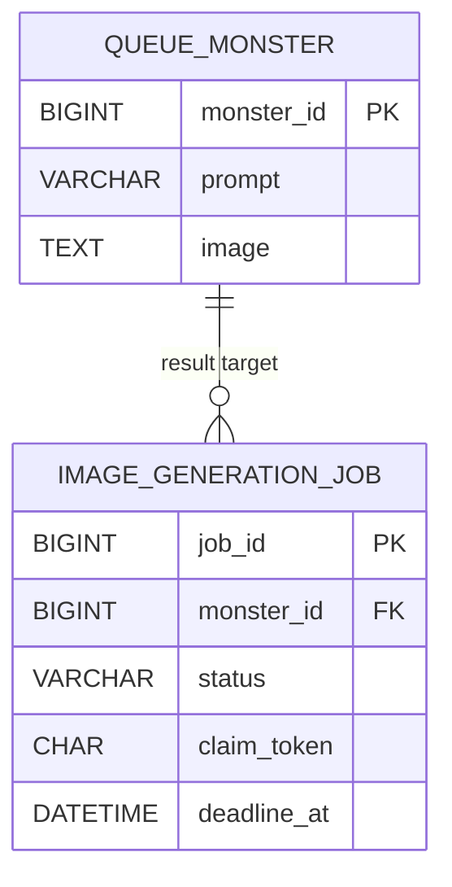
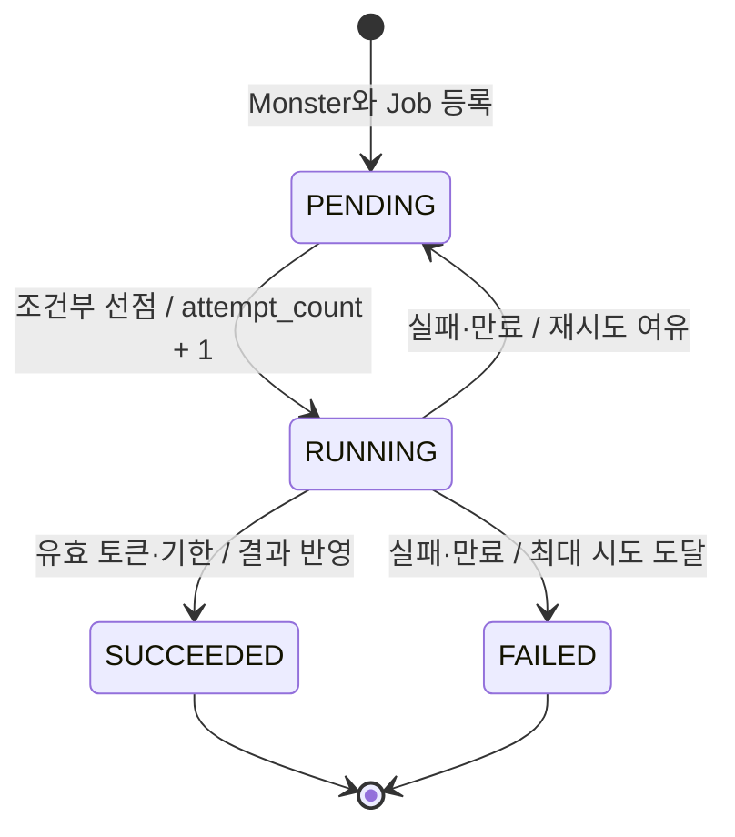
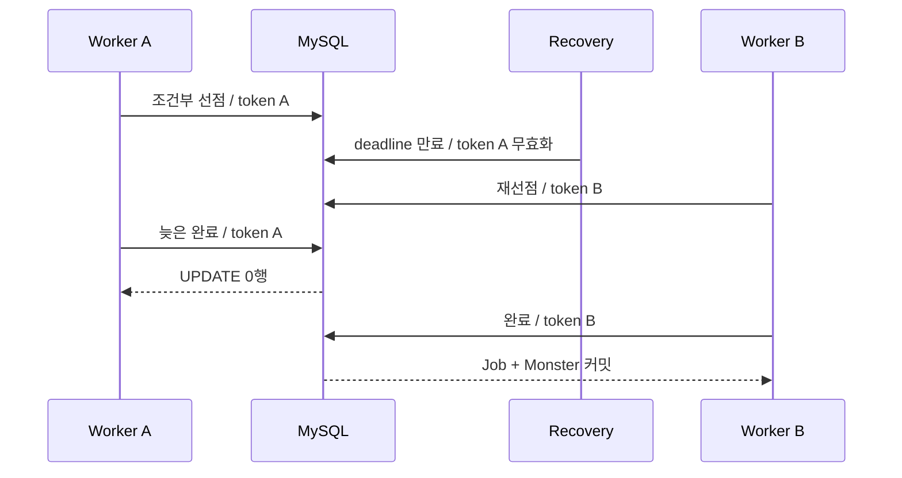

# 04. DB Job Queue 신뢰성 개선

## 결론 🧭

**채택:** Spring Boot와 Spring Data JPA로 개선된 DB Job Queue를 구성했다. Job을 삭제하지 않고 상태와 실행 소유권을 보존한다. 등록·선점·완료·실패·개별 만료 복구는 선언적 트랜잭션으로 분리하고, Generator는 트랜잭션 밖의 제한된 실행 풀에서 호출한다.

**보류:** MySQL 통합 테스트 코드는 작성하고 컴파일했지만 로컬 서버 인증 정보가 없어 실제 SQL·매핑·동시성 결과는 아직 확인하지 못했다. 이번 구현으로 과거 운영 장애의 원인이나 당시 유실·중복 발생을 확정하지 않는다.

## 기존 실패와 대응

| 03단계에서 확인하는 잠재적 문제 | 04단계 대응 | 구현 근거 |
| --- | --- | --- |
| 두 Worker의 동일 작업 선점 | `PENDING`·실행 시각·시도 횟수 조건의 JPQL UPDATE, 1행만 실행 | `ImageGenerationJobJpaRepository.claim` |
| 처리 전 삭제로 인한 유실 | Job 보존, `RUNNING` 기한 만료 시 재시도·종결 | `ExpiredJobRecovery`, `ExpiredJobTransition` |
| 결과 오연결 | Job에서 명시적 Monster FK 탐색 | `ImageGenerationJobEntity.monster`, `JobQueue.complete` |
| Monster·Job 등록 원자성 실패 | 같은 `JpaTransactionManager`의 `REQUIRES_NEW` | `JobQueue.request` |
| Scheduler 반복 실행 중단 | 작업 실패 전환과 Spring Scheduler 경계 예외 격리 | `JobWorker`, `JobPollingTasks` |

기존 RED 테스트 5개를 개선 구현에 그대로 이식하는 전체 회귀 검증은 05단계에 보류한다.

## 엔티티와 연관관계 🔗



`ImageGenerationJobEntity → QueueMonsterEntity` 단방향 `ManyToOne(fetch = LAZY)`를 채택했다.

- Job 완료 시 결과 대상을 탐색해야 하므로 Job에서 Monster 방향이 필요하다.
- Monster에서 Job 목록을 탐색하는 요구가 없어 `Monster.jobs`는 두지 않는다.
- 현재 등록 API가 1:1로 생성한다는 사실만으로 생명주기가 같다고 단정하지 않는다. `monster_id`에 UNIQUE를 두지 않는다.
- `CascadeType.ALL`, `REMOVE`, `orphanRemoval`은 적용하지 않는다. Job 기록 보존과 Monster 생명주기를 결합하지 않는다.
- DB에는 명시적 `fk_job_monster`를 적용한다.

엔티티는 일반 클래스와 protected 기본 생성자를 사용한다. ID는 `IDENTITY`, 상태는 문자열 enum으로 저장한다. public setter와 Lombok `@Data`는 사용하지 않는다.

## 상태와 필드 🔄



| 필드 | 역할 |
| --- | --- |
| `job_id` | 작업 식별자와 결과 멱등성 범위 |
| `monster_id` | 결과 대상 FK |
| `prompt` | Generator 입력 |
| `status` | `PENDING`, `RUNNING`, `SUCCEEDED`, `FAILED` |
| `attempt_count` | 조건부 선점 성공 시에만 증가. 최초 실행 포함 |
| `next_attempt_at` | 실행 또는 재시도 가능 시각 |
| `deadline_at` | 현재 선점의 고정 처리 기한 |
| `claim_token` | 선점마다 발급하는 UUID 소유권 |
| `created_at` | 등록 시각 |
| `started_at` | 최근 선점 시각 |
| `finished_at` | `SUCCEEDED`·`FAILED` 종결 시각 |
| `last_error` | 마지막 실패 원인, 최대 2,000자 |

`SUCCEEDED`와 `FAILED`는 자동 실행 대상에서 제외한다. 완료 Job은 삭제하지 않는다.

## 트랜잭션 경계 🔒

Boot가 구성한 하나의 `DataSource`, `EntityManagerFactory`, `JpaTransactionManager`를 사용한다. `JdbcTransactionManager`, `TransactionTemplate`, 직접 생성한 Repository는 없다.

| 연산 | 선언적 경계 | 포함 작업 | 경계 밖 |
| --- | --- | --- | --- |
| 등록 | `JobQueue.request`, `REQUIRES_NEW` | Monster persist + Job persist·flush | 호출자 작업 |
| 선점 | `JobQueue.tryClaim`, `REQUIRES_NEW` | 조건부 UPDATE + DTO projection 재조회 | 후보 조회, Generator |
| 완료 | `JobQueue.complete`, `REQUIRES_NEW` | 조건부 Job 완료 + Monster 조회·변경 감지·flush | 이미지 생성 |
| 실패 | `JobQueue.fail`, `REQUIRES_NEW` | 토큰·상태·기한 조건의 재시도 또는 FAILED UPDATE | 로그 |
| 개별 복구 | `ExpiredJobTransition.recover`, `REQUIRES_NEW` | 한 만료 Job의 조건부 UPDATE | 만료 후보 목록 조회·순회 |

기존 변경 연산의 `REQUIRES_NEW` 계약을 유지한다. 호출자 트랜잭션이 있어도 큐 변경은 독립 커밋된다. 이 선택은 별도 DB 연결과 suspend/resume 비용이 있다.

만료 목록 순회는 `ExpiredJobRecovery`, 개별 변경은 별도 Spring 서비스 `ExpiredJobTransition`으로 분리했다. 같은 객체 내부 호출로 트랜잭션 프록시가 우회되지 않는다.

## 조건부 UPDATE와 영속성 컨텍스트

선점·완료·실패·만료 복구는 모두 `@Modifying @Query`의 JPQL 벌크 UPDATE다. 엔티티 조회 후 값을 변경하고 `save()`하는 방식은 사용하지 않는다.

```text
후보 ID 조회
  → PENDING 조건부 UPDATE
  → UPDATE 1행 확인
  → 영속성 컨텍스트 clear
  → 실행용 DTO 재조회
  → 트랜잭션 커밋
  → Generator 실행
```

모든 벌크 UPDATE에 `flushAutomatically = true`, `clearAutomatically = true`를 적용했다.

- UPDATE 전에 이미 로딩한 변경이 있으면 먼저 flush한다.
- 벌크 UPDATE 후 오래된 엔티티는 clear로 분리한다.
- 선점 결과는 clear 이후 projection으로 다시 조회한다.
- 조건부 UPDATE 전에 엔티티 상태를 미리 바꾸지 않는다.
- Worker에 `EntityManager`, 영속 엔티티, LAZY 프록시를 넘기지 않는다. `Job` record만 전달한다.

완료는 다음 순서다.

1. `RUNNING`, `claim_token`, `deadline_at > now`를 검사하는 조건부 UPDATE.
2. 1행 성공 시 DB의 Job에서 `monster_id` projection 조회.
3. 대상 Monster 조회와 이미지 변경.
4. `flush()` 성공 후 Job 전환과 Monster 결과를 함께 커밋.

Monster 갱신이나 flush가 실패하면 같은 JPA 트랜잭션의 Job 완료 UPDATE도 롤백된다. 중복 완료와 이전 토큰은 UPDATE `0`행으로 거부한다.

## 원자적 선점과 늦은 결과 🔑



후보 조회는 소유권이 아니다. 두 Worker가 같은 ID를 읽어도 UPDATE가 1행인 실행만 Generator로 진행한다. 경합 시 무제한 재조회 루프는 두지 않는다. 비용은 패배 Worker의 SELECT·UPDATE 왕복과 다음 Polling까지의 지연이다.

기한 만료는 기존 Generator 스레드를 중단하지 않는다. 중복 실행은 가능하지만 이전 token의 결과·실패 반영은 거부한다. 보장 범위는 동일 `job_id` 결과 반영의 멱등성이다. Generator 호출 1회 보장은 아니다.

## 타임아웃과 재시도 ⏱️

`QueueSettings`는 `@ConfigurationProperties(prefix = "db-queue")`로 바인딩한다.

| 설정 | 기본값 | 의미와 제약 |
| --- | ---: | --- |
| 처리 기한 | 30초 | 실험용 초기값. 운영 생성 시간 분포로 정한 값 아님 |
| 최대 시도 | 3회 | 최초 실행 포함, 재시도 최대 2회 |
| 재시도 간격 | 1초 | 고정 간격. 지수 backoff·jitter 없음 |
| 동시 실행 | 2 | 실습 검증용 인스턴스별 상한 |
| Polling | 100ms | 실습 관찰 지연용 |
| 만료 복구 | 100ms | Polling과 독립 실행 |

Heartbeat는 비범위다. 상태 시각은 주입한 `Clock`을 마이크로초로 절삭해 사용한다. 테스트는 `MutableClock`을 전진시키며 처리 기한과 재시도 재현에 `Thread.sleep`을 사용하지 않는다.

## Scheduler와 실행 용량 ⚙️

- `JobPollingTasks`의 두 `@Scheduled` 메서드가 Polling과 만료 복구를 분리한다.
- 제어용 `ThreadPoolTaskScheduler` 크기는 2다. 긴 Generator는 별도 풀에서 실행돼 복구 슬롯을 점유하지 않는다.
- Generator용 `ThreadPoolExecutor` 크기와 Semaphore 슬롯은 `concurrency`로 제한한다.
- 실행 슬롯을 확보한 뒤에만 선점한다. 메모리 큐는 `ArrayBlockingQueue(concurrency)`로 제한한다.
- 제출 거부는 해당 Job의 실패·재시도 전환으로 연결한다. DB 기록까지 실패하면 `RUNNING`과 기한을 남겨 복구한다.
- 작업 예외는 `JobWorker`가 기록하고 재시도 정책으로 넘긴다.
- Scheduler 경계 예외는 `JobPollingTasks`가 `job_id=unassigned`, 연산명, 원인, 스택과 함께 SLF4J로 기록하고 다음 반복을 유지한다.
- `db-queue.scheduling-enabled=false`로 예약 실행을 끌 수 있다. 일반 통합 테스트는 끄고 전용 Scheduler 테스트에서만 켠다.
- 종료 시 `JobScheduler.close()`가 실행 풀과 대기 작업을 정리한다.

동시 실행 상한은 인스턴스별이다. 여러 프로세스 전체의 전역 용량 제한은 제공하지 않는다.

## MySQL 스키마와 시간·UUID

[`schema.sql`](./src/main/resources/db/hardening/schema.sql)은 다음을 명시한다.

- `AUTO_INCREMENT`, `InnoDB`, FK와 CHECK 제약.
- 준비·기한 조회용 복합 인덱스.
- `claim_token CHAR(36)`와 명시적 UUID 문자열 converter.
- `DATETIME(6)`과 UTC 세션.
- Monster 이미지 `TEXT`.

`MicrosecondClock`, Hibernate `jdbc.time_zone=UTC`, Hikari `SET time_zone = '+00:00'`로 애플리케이션 시각과 DB 정밀도·시간대를 맞춘다. `ddl-auto=validate`를 사용하며 시작 시 `create`나 `create-drop`으로 데이터를 지우지 않는다.

## 조회 계획과 SQL 검증

모든 Job 조회에 Monster fetch join을 적용하지 않는다.

| 유스케이스 | 조회 계획 |
| --- | --- |
| 실행 후보 | `job_id`만 projection, Monster 접근 없음 |
| 만료 후보 | 복구 필드와 `monster_id` projection |
| Worker 전달 | 불변 `Job` record |
| 결과 반영 | 완료 UPDATE 성공 후 `monster_id`, 해당 Monster만 조회 |
| 결과 확인 | 요청한 Monster 한 건만 조회 |

`JpaPersistenceContractTest`는 테스트 데이터 준비 후 `StatementInspector`를 초기화해 다음 실제 SQL 형태와 순서를 검사한다.

```sql
-- 선점
UPDATE image_generation_job ... WHERE job_id = ? AND status = ? ...;
SELECT job_id, monster_id, prompt, status, ... FROM image_generation_job WHERE job_id = ?;

-- 완료
UPDATE image_generation_job ... WHERE status = ? AND claim_token = ? AND deadline_at > ?;
SELECT monster_id FROM image_generation_job WHERE job_id = ?;
SELECT ... FROM queue_monster WHERE monster_id = ?;
UPDATE queue_monster SET image = ? WHERE monster_id = ?;
```

목록 조회 테스트는 서로 다른 Monster를 참조하는 Job 3개를 사용한다. Job만 조회하면 SQL 1회, LAZY 프록시 ID 접근까지 1회, Monster prompt 실제 접근 후 4회를 기대한다. 이는 LAZY가 N+1을 자동 해결한다는 주장이 아니라, 불필요한 연관 접근을 하지 않는 현재 projection 설계의 근거다.

위 assertion은 작성·컴파일됐다. 인증 정보가 없어 MySQL에서 생성된 실제 SQL과 쿼리 수 통과 여부는 아직 **확인 필요**다.

## 기본 검증 상태 ✅

2026-09-08 기준.

| 검증 | 상태 |
| --- | --- |
| 본 코드 컴파일 | 성공 |
| 전체 테스트 코드 컴파일 | 성공 |
| `bootJar` | 성공 |
| baseline+hardened 동시 활성화 거부 | 성공 |
| `./gradlew test --rerun-tasks` | 39개 발견, 1개 성공, DB 컨텍스트 38개 초기화 실패 |
| `./gradlew failureTest --rerun-tasks` | 5개 모두 DB 컨텍스트 초기화 실패. 기대 RED 아님 |
| 등록·완료 롤백 | 테스트 작성, MySQL 실행 확인 필요 |
| 조건부 선점·중복 완료·이전 토큰 거부 | 테스트 작성, MySQL 실행 확인 필요 |
| 만료·재시도·최대 시도 | 테스트 작성, MySQL 실행 확인 필요 |
| Generator 비트랜잭션·DTO 경계 | 테스트 작성, MySQL 실행 확인 필요 |
| Scheduler 후속 특정 Job 완료 | 테스트 작성, MySQL 실행 확인 필요 |
| UUID·UTC·마이크로초·실제 SQL | 테스트 작성, MySQL 실행 확인 필요 |

## 부정·제약과 다음 단계 ⚠️

- MySQL 서버 버전, 실제 DDL validation, 잠금·격리·SQL 순서는 인증 후 확인 필요다.
- H2를 제거했으므로 DB 없이 통합 테스트가 통과하지 않는다.
- 프로세스 재시작 후 영속성, 운영 연결 풀·쿼리 타임아웃, 처리량은 검증하지 않았다.
- 고정 재시도만 제공한다. 영구 실패 분류와 시도별 이력 테이블은 없다.
- HTTP API, Heartbeat, 메시지 브로커, 실제 Python AI Worker·GCS는 비범위다.
- 05단계 전체 회귀 검증과 06단계 300개 작업 측정은 보류한다.
