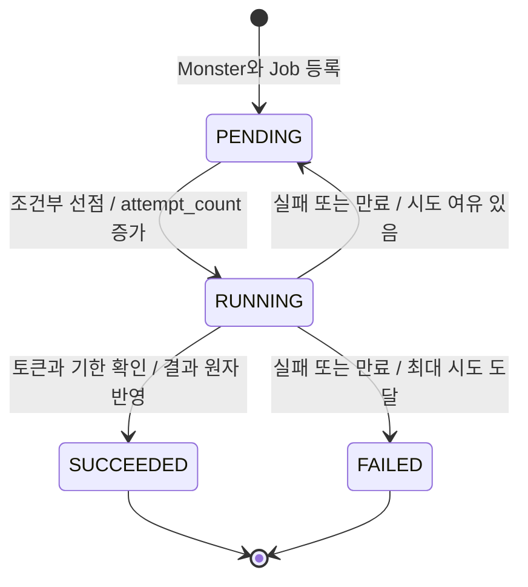
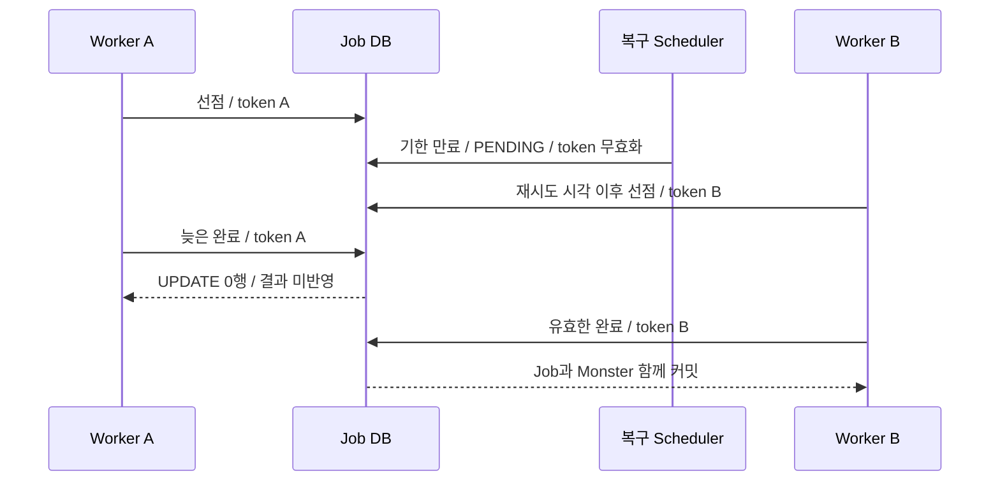

# 04. DB Job Queue 신뢰성 개선

## 결론 🧭

**채택:** Job을 삭제하지 않고 상태와 실행 소유권을 저장한다. 등록·선점·완료를 짧은 JDBC 트랜잭션으로 처리하고, 이미지 생성은 제한된 실행 풀에서 수행한다. 04단계 구현과 기본 테스트 23개를 완료했다.

**유지:** Java 21, Spring JDBC, H2, JUnit 5와 독립 Gradle 프로젝트. 02·03단계 코드는 보존하고, 새 구현은 `com.kng0501.dbqueue` 패키지에 배치했다. 2025년 당시 안정화와 이번 현재 신뢰성 개선은 구분한다. 이번 결과로 과거 운영 장애의 원인이나 당시 유실·중복 여부를 확정하지 않는다.

## 기존 실패와 대응

| 03단계에서 확인한 잠재적 문제 | 04단계 대응 | 근거 |
| --- | --- | --- |
| 두 Worker의 동일 작업 선점 | `PENDING`·실행 가능 시각·시도 횟수를 조건으로 UPDATE, 1행인 실행만 진행 | `JdbcJobRepository.claim` |
| 처리 전 삭제로 인한 유실 | Job 보존, `RUNNING` 처리 기한 만료 시 재시도 또는 종료 | `JobQueue.recoverExpired` |
| 결과 오연결 | DB에 저장한 `monster_id` FK로만 이미지 갱신 | `JobQueue.complete` |
| Monster·Job 등록 원자성 실패 | 두 INSERT를 동일 로컬 트랜잭션으로 묶음 | `JobQueue.request` |
| Scheduler 반복 실행 중단 | 작업 실패 기록과 Scheduler 경계의 예외 격리 | `JobWorker`, `JobScheduler` |

이 표는 설계 대응 관계다. 기존 RED 테스트 5개를 새 구현에 이식하는 전체 회귀 검증은 05단계에 **보류**한다.

## 상태와 필드 🔄



`SUCCEEDED`와 `FAILED`는 자동 실행 대상에서 제외한다. 그림의 종료는 행 삭제를 뜻하지 않는다. 완료된 Job도 검증·측정용으로 보존한다.

| 필드 | 역할과 갱신 규칙 |
| --- | --- |
| `job_id` | 작업 식별자. 결과 반영 멱등성의 범위 |
| `monster_id` | 결과 대상의 명시적 FK. Job ID와 같다고 가정하지 않음 |
| `prompt` | 해당 Job의 이미지 생성 입력 |
| `status` | `PENDING`, `RUNNING`, `SUCCEEDED`, `FAILED` |
| `attempt_count` | 조건부 선점 성공 시에만 증가. 최초 실행도 최대 시도 횟수에 포함 |
| `next_attempt_at` | `PENDING`이 실행 가능해지는 시각. 종결 상태에서는 보존만 함 |
| `deadline_at` | 현재 선점의 고정 처리 기한. `RUNNING`을 벗어나면 NULL |
| `claim_token` | 선점마다 새 UUID. 실패·만료·완료 전환 시 NULL |
| `created_at` | 등록 시각 |
| `started_at` | 가장 최근 선점 성공 시각. 이전 시도별 이력 테이블은 없음 |
| `finished_at` | `SUCCEEDED` 또는 `FAILED`로 종결된 시각. 재시도 대기는 NULL |
| `last_error` | 마지막 실패 원인, 최대 2,000자. 재시도 후 성공해도 마지막 실패 기록은 보존 |

스키마는 [`db/hardening/schema.sql`](./src/main/resources/db/hardening/schema.sql), 초기화는 [`QueueDatabaseInitializer`](./src/main/java/com/kng0501/dbqueue/persistence/QueueDatabaseInitializer.java)를 사용한다. 테이블은 `queue_monster`, `image_generation_job`이다. 02단계의 `db/schema.sql`, `monster`, `image_generation_request`와 구분된다.

## 트랜잭션 경계 🔒

[`JobQueue`](./src/main/java/com/kng0501/dbqueue/application/JobQueue.java)가 하나의 DataSource로 `JdbcTemplate`, 두 JDBC 저장소, `JdbcTransactionManager`, `TransactionTemplate`을 구성한다. 직접 생성한 객체도 Spring JDBC의 동일 연결과 트랜잭션에 참여한다.

| 연산 | 하나의 트랜잭션에 포함되는 작업 | 트랜잭션 밖의 작업 |
| --- | --- | --- |
| 등록 | Monster INSERT + Job INSERT | 호출자 입력 전달 |
| 선점 | 조건부 Job UPDATE + 선점 결과 조회 | 후보 조회, Generator 실행 |
| 완료 | 조건부 `SUCCEEDED` UPDATE + FK 조회 + Monster UPDATE | 이미지 생성 |
| 실패·복구 | 현재 토큰·상태·기한을 조건으로 한 Job UPDATE | 로그 기록, 다음 Polling 대기 |

**채택:** `REQUIRES_NEW`로 각 큐 연산의 커밋 시점을 명확히 한다. 선점 결과는 해당 트랜잭션이 커밋된 뒤에만 Worker로 반환한다. 이 구조의 비용은 호출자 트랜잭션이 있다면 별도 연결이 필요하다는 점이다. 큐 등록은 호출자의 바깥 트랜잭션과 함께 롤백되는 API가 아니다. 이번 직접 생성 구조에서는 별도 비즈니스 트랜잭션을 두지 않는다.

등록 중 한 INSERT라도 실패하면 둘 다 롤백한다. 완료는 다음 조건부 UPDATE가 1행을 변경한 경우에만 Monster를 갱신한다.

```sql
WHERE job_id = ?
  AND status = 'RUNNING'
  AND claim_token = ?
  AND deadline_at > ?
```

조건부 전환이 먼저 해당 Job 행을 잠근다. 별도 SELECT로 소유권을 확인한 뒤 무조건 UPDATE하는 간격을 만들지 않는다. Monster UPDATE가 실패하거나 0행이면 예외를 발생시켜 `SUCCEEDED` 전환까지 롤백한다. 다른 완료·실패·복구가 경합하면 같은 행의 조건을 다시 만족해야 한다.

## 조건부 선점의 선택

**채택:** 실행 가능한 후보 한 건을 읽은 뒤, `PENDING`, `next_attempt_at <= now`, `attempt_count < maxAttempts`를 다시 검사하는 UPDATE로 선점한다. 성공 시 상태·토큰·기한·시작 시각을 기록하고 시도 횟수를 증가시킨다.

후보 조회는 소유권 획득이 아니다. 두 Worker가 같은 후보를 읽어도 UPDATE가 1행인 Worker만 실행한다. 0행이면 해당 Polling을 끝낸다. 경합 시 무제한 재조회 루프는 **거부**한다.

비용은 경합에서 진 Worker의 조회·UPDATE 왕복과 다음 Polling까지의 대기다. 다수 Worker가 같은 선두 후보에 몰릴 수 있고, 이번 방식은 대규모 처리량을 검증한 선택이 아니다. `SKIP LOCKED` 등 DB별 선점 문법은 도입하지 않았다.

## 늦은 결과와 멱등성 🔑



**채택:** 완료뿐 아니라 실패 전환도 현재 `RUNNING` 상태와 토큰을 검사한다. 일반 실패는 `deadline_at > now`일 때만 반영한다. 기한이 만료된 실행은 복구 경로가 처리한다. 오래된 실패가 새 실행이나 이미 완료된 Job을 변경할 수 없다.

같은 완료를 반복해도 첫 커밋 이후에는 상태가 `SUCCEEDED`라서 결과를 다시 갱신하지 않는다. 멱등성은 **동일 `job_id`의 결과 반영**에 한정된다. 요청 자체의 중복 접수 제거, 서로 다른 Job 사이의 멱등성, Generator 호출 횟수 1회 보장은 제공하지 않는다.

## 타임아웃과 재시도 ⏱️

**채택:** Heartbeat 없이 선점 시각부터 고정 처리 기한을 둔다. `deadline_at <= now`이면 복구 대상이다. 재시도 횟수가 남으면 `PENDING`과 `next_attempt_at = 복구 또는 실패 시각 + retryDelay`를 기록한다. 최대 시도 횟수에 도달하면 `FAILED`와 종료 시각을 기록한다. 일반 예외와 만료는 같은 전환 정책을 사용한다.

[`QueueSettings.experimentalDefaults()`](./src/main/java/com/kng0501/dbqueue/domain/QueueSettings.java)는 다음 **실험용 초기값**을 제공한다. 생성자 인자로 전부 변경할 수 있다.

| 설정 | 초기값 | 선택 이유와 제약 |
| --- | --- | --- |
| 처리 기한 | 30초 | 짧은 테스트 Generator에 여유를 둔 시작점. 운영 모델 시간 분포로 검증한 값 아님 |
| 최대 시도 횟수 | 3회 | 최초 실행 1회 + 재시도 최대 2회로 종결을 관찰 |
| 재시도 간격 | 1초 | 즉시 반복 실패를 피하는 고정 간격. 지수 backoff·jitter 없음 |
| 동시 실행 수 | 2 | 작은 병렬 실행 검증용. 실제 AI 처리 용량을 뜻하지 않음 |
| Polling 간격 | 100ms | 소규모 실습의 관찰 지연을 줄이기 위한 값 |
| 복구 검사 간격 | 100ms | 실행과 별도로 만료를 관찰하기 위한 값 |

약 5초라는 과거 기억으로 처리 기한을 정하지 않았다. 실제 적용 시 생성 시간 분포, 장치 수, DB 연결 수와 요청 유입량 측정이 **확인 필요**다.

상태 판단 시각은 주입한 `java.time.Clock`에서만 얻는다. 테스트는 [`MutableClock`](./src/test/java/com/kng0501/dbqueue/support/MutableClock.java)을 전진시켜 기한 직전·정확한 만료 시각·재시도 시각을 검사한다. 시간 경과 재현에 `Thread.sleep`을 사용하지 않는다. 실제 스레드 진행 관찰만 제한 시간이 있는 latch·barrier와 상태 조회를 사용한다.

기한 만료는 Generator 실행을 자동으로 중단하지 않는다. 기존 실행과 재선점 실행이 겹칠 수 있다. 결과 반영은 토큰으로 차단하며, 실행이 끝나지 않은 기존 스레드의 슬롯을 만료만으로 돌려주지 않는다.

## 실행 용량과 Scheduler 예외 처리 ⚙️

[`JobScheduler`](./src/main/java/com/kng0501/dbqueue/application/JobScheduler.java)는 제어용 스레드 2개에서 Polling과 만료 복구를 각각 반복한다. Generator는 별도 고정 크기 `ThreadPoolExecutor`에서 실행한다. 긴 Generator 실행이 복구 스레드를 점유하지 않는다.

- **채택:** Semaphore 슬롯을 얻은 뒤에만 후보 조회와 선점을 수행한다. 한 Polling에서 최대 `concurrency`번만 시도하고 경합에서 지면 종료한다.
- 실행 풀의 메모리 큐는 `ArrayBlockingQueue(concurrency)`로 제한한다. 큐 대기와 실행을 합친 승인 작업 수는 Semaphore에 의해 `concurrency` 이하로 제한된다. 여유 작업은 DB의 `PENDING`으로 남는다.
- 선점 후 제출이 거부되면 해당 Job에 실패·재시도 정책을 적용하고 슬롯을 반환한다. 실패 기록도 불가능하면 `RUNNING`과 기한을 유지해 복구가 다시 시도한다.
- [`JobWorker`](./src/main/java/com/kng0501/dbqueue/application/JobWorker.java)는 Generator·완료 처리 예외를 Job 실패로 연결한다. DB에 실패를 기록하지 못하면 오류를 기록하고 기한 복구에 맡긴다.
- Scheduler 경계는 `RuntimeException`을 기록하고 다음 반복 실행을 유지한다. `job_id`, `attempt_count`, 원인과 예외를 남긴다. 후보를 얻기 전의 인프라 오류는 식별자를 알 수 없어 `unassigned`·`unknown`과 연산명을 기록한다.
- 복구는 한 번에 최대 100건을 조회해 작업별 트랜잭션으로 처리한다. 한 건의 기록 실패는 다른 후보의 복구를 중단하지 않는다. 반복적으로 실패하는 선두 100건에 의한 지연까지 해결하는 공정성 정책은 없다.
- `close()`는 제어·실행 풀을 중단하고 제출됐지만 시작하지 않은 Job에도 실패 정책을 적용한다. 각 풀의 종료를 최대 5초 기다리며, 끝나지 않으면 경고를 남긴다. `Error`나 interrupt에 협조하지 않는 Generator를 강제로 정상 종료하는 보장은 없다.

동시 실행 수는 Scheduler 인스턴스별 제한이다. 여러 프로세스 전체의 전역 실행 용량 제한은 구현하지 않았다. 모든 슬롯의 Generator가 멈추면 복구는 진행해도 그 인스턴스에서 새 작업을 실행할 슬롯은 생기지 않는다.

## 코드 사용과 배치

```java
var settings = QueueSettings.experimentalDefaults();
new QueueDatabaseInitializer(dataSource).initialize(); // 새로운 실습 DB에서 한 번 실행
var queue = new JobQueue(dataSource, Clock.systemUTC(), settings);
var request = queue.request("blue dragon");
var scheduler = new JobScheduler(queue, prompt -> "image:" + prompt, settings);
scheduler.start();
// 요청의 jobId로 상태를 조회한다. 애플리케이션 종료 시 scheduler.close()를 호출한다.
```

HTTP 서버나 실제 AI 어댑터는 없다. 위 Generator는 연결 예시다. 스키마 초기화는 마이그레이션 도구가 아니며 기존 테이블에 반복 적용하지 않는다.

| 위치 | 내용 |
| --- | --- |
| [`src/main/java/com/kng0501/dbqueue/application`](./src/main/java/com/kng0501/dbqueue/application) | 트랜잭션 조정, Worker, Scheduler |
| [`src/main/java/com/kng0501/dbqueue/domain`](./src/main/java/com/kng0501/dbqueue/domain) | Job·상태·Monster·Generator·설정 |
| [`src/main/java/com/kng0501/dbqueue/persistence`](./src/main/java/com/kng0501/dbqueue/persistence) | JDBC SQL과 독립 초기화 |
| [`src/test/java/com/kng0501/dbqueue`](./src/test/java/com/kng0501/dbqueue) | 기본 테스트와 시간·DB 오류 주입 도구 |

## 기본 검증 결과 ✅

2026-09-06, `technical-writing`에서 실행:

```bash
./gradlew test --rerun-tasks
./gradlew failureTest --rerun-tasks
```

| 테스트 | 개수 | 검증 내용 |
| --- | ---: | --- |
| 기존 02단계 정상 테스트 | 5 | 기준 구현의 기본 동작 유지 |
| [`JobQueueTest`](./src/test/java/com/kng0501/dbqueue/application/JobQueueTest.java) | 14 | 등록 롤백, 선점 경합, FK, 완료 원자성·중복·토큰, 만료 경계, 재시도 상한 |
| [`JobWorkerTest`](./src/test/java/com/kng0501/dbqueue/application/JobWorkerTest.java) | 3 | 생성 중 트랜잭션 없음, 실패 기록 오류 후 복구, 복구 오류 격리 |
| [`JobSchedulerTest`](./src/test/java/com/kng0501/dbqueue/application/JobSchedulerTest.java) | 6 | 특정 후속 Job 완료·이미지, 조회 예외 이후 반복, 슬롯 제한, 독립 복구, 제출 거부, 종료 |
| `test` 합계 | 28 | 전부 통과, `BUILD SUCCESSFUL`, 종료 코드 0 |
| 기존 03단계 `failureTest` | 5 | 의도한 assertion에서 전부 실패, 종료 코드 1 |

03단계 리포트의 기대/실제는 그대로다: 중복 처리·생성 `1/2`, 미완료 Job 행 `1/0`, 무관한 Monster 이미지 존재 `false/true`와 대상 이미지 `image:blue dragon/null`, 등록 실패 후 Monster 수 `0/1`, 후속 처리 `true/false`와 대기 Job 수 `0/1`.

04단계 Scheduler 검증은 Generator 호출 수만 세지 않는다. 특정 후속 `job_id`의 `SUCCEEDED` 상태와 해당 Monster의 이미지까지 확인한다. 동시성 테스트의 Executor, Scheduler, 상태 관찰기는 종료 시 정리한다.

## 부정·제약과 다음 단계 ⚠️

- H2 메모리 DB 검증이다. 프로세스 재시작 후 데이터 영속성, MySQL 잠금·격리·SQL 동작, 운영 규모 처리량은 검증하지 않았다.
- 기한은 주입 Clock의 연산 시각을 기준으로 판단한다. 프로세스 사이 시계 오차, DB 지연, 운영용 연결 풀·쿼리 타임아웃 설정은 별도 검토가 필요하다.
- 고정 재시도 정책을 모든 일반 예외에 적용한다. 영구 실패 분류와 시도별 상세 이력·보존 기간 정책은 없다.
- Heartbeat, 메시지 브로커, MySQL Testcontainers, 실제 Python AI Worker·GCS, HTTP·SSE·ETA API는 **비범위**다.
- 05단계 전체 회귀 검증과 06단계 300개 작업 부하 측정은 **보류**한다. 이번 완료는 04단계 구현과 기본 검증에 한정된다.
