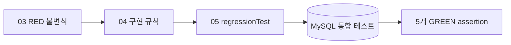

# 05. 신뢰성 회귀 검증

## 결론 🧪

**채택:** 03단계의 다섯 RED 불변식을 04단계 MySQL 통합 테스트 다섯 건으로 다시 검증한다. 네 건은 기존 04 테스트 메서드에 `regression-verification` 태그를 붙여 재사용하고, Worker 무응답 뒤 타임아웃 복구 테스트 한 건만 추가한다.

**제약:** 이 단계는 실제 JVM kill을 수행하지 않는다. Worker가 선점 후 완료·실패 요청을 보내지 않는 `RUNNING` DB 상태를 만들고, 처리 기한 만료 뒤 다른 Worker가 재선점하는 흐름을 검증한다.



## 03 RED ↔ 05 GREEN 대응

| 불변식 | 03 RED 테스트 | 05 회귀 테스트 | 04 해결 규칙 |
| --- | --- | --- | --- |
| 동시 선점 | `DuplicateClaimFailureTest` | `JobQueueTest.같은_후보를_읽은_두_Worker_중_조건부_UPDATE가_성공한_하나만_선점한다` | `PENDING` 조건부 UPDATE와 영향 행 1건 확인 |
| Worker 무응답 뒤 복구 | `WorkerTerminationFailureTest` | `JobQueueTest.응답하지_않는_Worker의_선점은_타임아웃_후_복구되고_새_토큰만_결과를_반영한다` | `RUNNING` 보존, `deadline_at`, 재시도, 새 `claimToken` |
| 결과 오연결 | `ResultMisconnectionFailureTest` | `JobQueueTest.결과는_Job_ID가_아닌_명시적_monsterId로_연결한다` | Job의 `monster_id`와 조건부 완료 뒤 native UPDATE |
| 등록 비원자성 | `RequestRegistrationAtomicityFailureTest` | `JobRegistrationServiceTest.Job_저장이_실패하면_Monster도_롤백한다` | Monster·Job 등록의 동일 `REQUIRES_NEW` 트랜잭션 |
| Scheduler 중단 | `SchedulerContinuityFailureTest` | `ScheduledPollingIntegrationTest.한_작업의_실패_후에도_스케줄러가_특정_후속_Job을_완료한다` | Job 실패 전환과 Scheduler 경계 예외 격리 |

## 새 Worker 무응답 복구 테스트 ⏱️

새 테스트는 첫 Worker가 Job을 선점한 뒤 응답하지 않는 상태를 만든다. `TestClock`을 `processingTimeout`, `retryDelay`만큼 전진시킨 후 `ExpiredJobRecovery`가 작업을 다시 `PENDING`으로 전환하는지 확인한다. 두 번째 claimToken으로만 완료할 수 있고, 첫 claimToken의 늦은 완료는 거부되어야 한다.

최종 assertion은 다음과 같다.

- `SUCCEEDED`
- `attemptCount == 2`
- 첫 claimToken 완료 거부
- 두 번째 claimToken 완료 성공
- 최종 이미지 `image:recovered`
- Job과 Monster 행 각각 1건 보존

이 검증은 프로세스 종료 신호, JVM 메모리 정리, OS 수준 kill 동작을 검증하지 않는다. DB에 남은 선점 상태의 복구 규칙만 검증한다. ⚠️

## 실행

```bash
cd /Users/kangrae/Documents/GitHub/woowa-archive/technical-writing

export TECHNICAL_WRITING_TEST_DB_URL='jdbc:mysql://127.0.0.1:3306/technical_writing_test?connectionTimeZone=UTC&forceConnectionTimeZoneToSession=true'
export TECHNICAL_WRITING_TEST_DB_USERNAME='test_user'
export TECHNICAL_WRITING_TEST_DB_PASSWORD='...'

./gradlew regressionTest --rerun-tasks
```

- `test`: `failure-reproduction`, `regression-verification` 태그를 제외한 일반 테스트
- `failureTest`: 03단계 RED 테스트 다섯 건만 실행. assertion 실패와 종료 코드 `1`이 기대 결과
- `regressionTest`: `regression-verification` 태그가 붙은 GREEN 테스트 다섯 건만 실행. `BUILD SUCCESSFUL`이 기대 결과 ✅

DB 접속·Context 초기화·JPA 매핑 오류는 회귀 검증 성공이 아니다.

## 실제 검증 결과

2026-09-14에 아래 명령을 실행했다.

| 명령 | 실제 결과 | 판정 |
| --- | --- | --- |
| `./gradlew clean compileJava compileTestJava` | `BUILD SUCCESSFUL` | 통과 |
| `./gradlew tasks --group verification` | `regressionTest` 등록 확인 | 통과 |
| `./gradlew test --rerun-tasks` | `BUILD SUCCESSFUL` | 통과 |
| `./gradlew failureTest --rerun-tasks` | 03 RED 테스트 5건이 각 불변식 assertion에서 실패 | 의도된 종료 코드 `1` |
| `./gradlew regressionTest --rerun-tasks` | 이 문서의 GREEN 테스트 5건 통과 | `BUILD SUCCESSFUL` |

전용 MySQL 테스트 DB에서 다섯 GREEN 불변식 assertion이 모두 통과했다. H2 대체나 테스트 생략은 하지 않았다. 실제 JVM kill, OS 수준 종료 신호, 프로세스 재시작 자체는 자동 테스트 범위가 아니다.

## 비범위

300개 작업 측정, 성능 측정, 메시지 브로커, Heartbeat, 실제 AI 생성, 실제 JVM kill은 비범위다.
