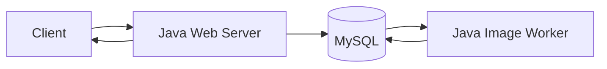

# DB Polling 재구성과 신뢰성 검증 기록

## 결론

**채택:** 02와 04는 동일한 외부 구조를 사용한다. Java 웹 서버가 MySQL에 요청을 저장하고, 별도 JVM의 Java 이미지 생성 워커가 Polling으로 작업을 읽어 결과를 기록한다. 차이는 아키텍처가 아니라 신뢰성 보장이다.

**유지:** 단일 Gradle 프로젝트와 단계별 폴더, Java 21, Spring Boot, Spring Data JPA, 로컬 MySQL을 유지한다. 멀티모듈, 메시지 브로커, 실제 AI 모델은 비범위다.



MySQL만 두 프로세스 사이에서 공유한다. Server와 Worker는 Java 클래스를 공유하지 않고, 각각 필요한 Entity·Repository·enum을 별도로 가진다. Bean, Entity 인스턴스, 영속성 컨텍스트, 메모리 큐는 공유하지 않는다.

이 선택의 비용은 중복 JPA 매핑과 enum이 스키마 변경 시 어긋날 수 있다는 점이다. `monster_id`, 상태 값, 컬럼명·정밀도를 바꾸면 두 프로세스의 매핑을 함께 확인해야 한다.

## 단계

| 단계 | 목적 | 상태 |
| --- | --- | --- |
| [01](./01-past-structure-and-limitations/README.md) | 과거 경험과 측정 한계 기록 | 완료 |
| [02](./02-minimal-db-polling/README.md) | 정상 상황의 최소 DB Polling | 구현 완료·MySQL 검증 확인 필요 |
| [03](./03-failure-reproduction/README.md) | 기준 구현의 잠재적 실패 5개 RED 재현 | 테스트 작성·MySQL RED 확인 필요 |
| [04](./04-reliability-hardening/README.md) | 상태·선점·재시도·복구·멱등성 추가 | 구현 완료·MySQL 검증 확인 필요 |
| [05](./05-regression-verification/README.md) | 기준 RED 테스트의 전체 회귀 검증 | 보류 |
| [06](./06-final-300-job-measurement/README.md) | 300개 작업 최종 측정 | 보류 |

## Application 구조

| 단계 | 웹 서버 | 이미지 워커 | MySQL 테이블 |
| --- | --- | --- | --- |
| 02 | `com.kng0501.dbpolling.server.WebServerApplication` | `com.kng0501.dbpolling.worker.ImageWorkerApplication` | `monster`, `image_generation_request` |
| 04 | `com.kng0501.dbqueue.server.WebServerApplication` | `com.kng0501.dbqueue.worker.ImageWorkerApplication` | `queue_monster`, `image_generation_job` |

웹 Application은 Controller, 요청 등록·결과 조회 서비스, 해당 단계 JPA Entity·Repository만 등록한다. 워커 Application은 Polling, Scheduler, `ImageGenerator`, 실행 Executor와 04의 복구 Bean만 등록한다. 워커는 `WebApplicationType.NONE`으로 시작해 HTTP 포트를 열지 않는다.

Spring Profile은 역할이나 구현 버전을 선택하는 데 사용하지 않는다.

## 공통 실험 조건

| 항목 | 02와 04 공통 기본값 | 제약 |
| --- | --- | --- |
| DB | 같은 로컬 MySQL URL | 각 JVM은 별도 Hikari Pool 소유 |
| 요청 | `POST /jobs` JSON `{ "prompt": "..." }` | 02 응답에는 Job 상태 없음 |
| Polling 간격 | 100ms | 관찰용 초기값 |
| 워커 동시 처리 | 1 | 테스트는 제어 목적으로 별도 값을 사용 가능 |
| 모의 이미지 생성 | 5초 후 `image:{prompt}` | 실제 AI 성능 측정값 아님 |
| 처리 기한 | hardened 30초 | 5초 모의 생성보다 길게 둔 실습용 값 |

테스트는 제어 가능한 Generator를 주입하므로 실제 5초를 기다리지 않는다.
02와 04의 예시는 같은 `blue dragon` 요청을 사용한다. 이는 모의 이미지 생성 조건을 맞추기 위한 예시일 뿐 성능 비교 결과가 아니다.

## 로컬 MySQL 준비

애플리케이션 DB와 테스트 DB를 분리한다. 기존 DB 전체를 삭제하거나 `ddl-auto=create`, `create-drop`을 사용하지 않는다.

```sql
CREATE DATABASE IF NOT EXISTS technical_writing
    CHARACTER SET utf8mb4 COLLATE utf8mb4_0900_ai_ci;
CREATE DATABASE IF NOT EXISTS technical_writing_test
    CHARACTER SET utf8mb4 COLLATE utf8mb4_0900_ai_ci;
```

```bash
export TECHNICAL_WRITING_DB_URL='jdbc:mysql://127.0.0.1:3306/technical_writing?connectionTimeZone=UTC&forceConnectionTimeZoneToSession=true'
export TECHNICAL_WRITING_DB_USERNAME='application_user'
export TECHNICAL_WRITING_DB_PASSWORD='...'

export TECHNICAL_WRITING_TEST_DB_URL='jdbc:mysql://127.0.0.1:3306/technical_writing_test?connectionTimeZone=UTC&forceConnectionTimeZoneToSession=true'
export TECHNICAL_WRITING_TEST_DB_USERNAME='test_user'
export TECHNICAL_WRITING_TEST_DB_PASSWORD='...'

# JVM 하나당 Hikari 상한. web + worker 동시 실행 시 기본 합계는 10개다.
export TECHNICAL_WRITING_DB_POOL_SIZE='5'
```

애플리케이션 시작 시 DDL을 수행하지 않는다. 두 JVM이 동시에 스키마를 초기화하는 경합을 피하기 위해, 웹·워커 시작 전에 한 번만 SQL을 적용한다.

```bash
# application_user와 technical_writing은 실제 값으로 바꾼다.
mysql --host=127.0.0.1 --user=application_user --password technical_writing \
  < 02-minimal-db-polling/src/main/resources/db/02/schema.sql
mysql --host=127.0.0.1 --user=application_user --password technical_writing \
  < 04-reliability-hardening/src/main/resources/db/04/schema.sql
```

스키마는 `IF NOT EXISTS` DDL과 `ddl-auto=validate`를 유지한다. 테스트는 전용 테스트 DB에 필요한 단계 스키마만 초기화하고, 02·04의 네 테이블만 정리한다.

단일 Gradle source set에서 두 단계 리소스를 함께 읽으므로 classpath 충돌을 피하기 위해 SQL 경로는 `db/02/schema.sql`, `db/04/schema.sql`로 구분한다. 이전의 구현 버전 이름은 경로에 사용하지 않는다.

## 네 실행 명령

서로 다른 터미널에서 각 Gradle 작업을 실행하면 별도 JVM이 시작된다. 역할 선택을 위한 `--spring.profiles.active` 옵션은 사용하지 않는다.

```bash
cd /Users/kangrae/Documents/GitHub/woowa-archive/technical-writing

# 02: 터미널 1, 터미널 2
./gradlew run02WebServer
./gradlew run02ImageWorker

# 04: 터미널 1, 터미널 2
./gradlew run04WebServer
./gradlew run04ImageWorker
```

각 터미널에서 `Ctrl-C`를 보내면 해당 JVM만 종료한다. 워커가 종료되어도 웹 서버는 DB에 요청을 저장한다. 웹 서버가 종료되어도 워커는 기존 DB 작업을 계속 처리한다.

## HTTP API

| 단계 | 등록 | 조회 | 응답 의미 |
| --- | --- | --- | --- |
| 02 | `POST /jobs` | `GET /monsters/{monsterId}` | `202 { monsterId }`. 상태와 jobId는 없음 |
| 04 | `POST /jobs` | `GET /jobs/{jobId}` | `202 { jobId, monsterId }`. 상태·시도·결과 반환 |

```bash
curl -i -X POST http://127.0.0.1:8080/jobs \
  -H 'Content-Type: application/json' \
  -d '{"prompt":"blue dragon"}'
```

웹 서버는 Worker를 직접 호출하지 않는다. `@Async`, 애플리케이션 이벤트, 공유 메모리 큐는 사용하지 않는다.

## 검증

```bash
./gradlew test --rerun-tasks
./gradlew failureTest --rerun-tasks
```

- `test`: 정상 동작, JPA 매핑, 웹·워커 Context 분리를 검증한다.
- `failureTest`: 03단계의 `failure-reproduction` 5개만 실행한다. 다섯 불변식 assertion에서 실패해야 하며 종료 코드 `1`이 기대 결과다.
- DB 접속, Context 초기화, JPA 매핑 오류는 RED 재현 성공이 아니다.

2026-09-09 기준 검증 결과는 다음과 같다.

| 명령 | 결과 |
| --- | --- |
| `./gradlew clean compileJava compileTestJava` | 성공 |
| `./gradlew tasks --group application` | `run02WebServer`, `run02ImageWorker`, `run04WebServer`, `run04ImageWorker` 등록 확인 |
| `./gradlew test --rerun-tasks` | 현재 리팩터링 뒤 재실행 보류. TEST_DB URL 미설정 상태 |
| `./gradlew failureTest --rerun-tasks` | 현재 리팩터링 뒤 재실행 보류. TEST_DB URL 미설정 상태 |

MySQL 인증 정보가 없으므로 통합 테스트, RED assertion, 실제 두 JVM 검증 결과는 확인 필요다. H2 대체나 테스트 생략은 하지 않았다.

## 비범위

Heartbeat, 메시지 브로커, 실제 Python AI Worker·GCS, SSE, ETA, 인증·운영 배포는 비범위다. 05 전체 회귀 검증과 06의 300개 작업 측정도 진행하지 않는다.
